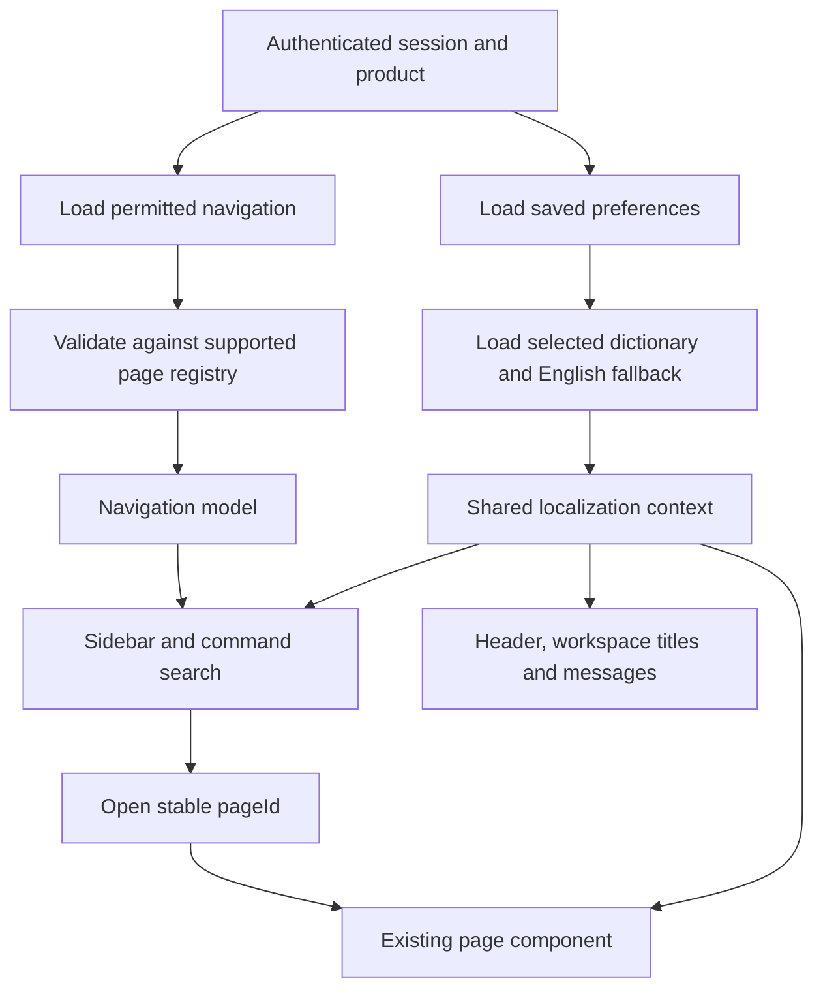

# Backend menus and full-page localization: implementation plan

Date: 8 September 2026

Status: Implementation started. See [the milestone report](./backend-navigation-implementation.md) for completed work and remaining acceptance gates.

Audience: Product owners, frontend developers, backend developers, and translators.

Platforms: Desktop-first web and Tauri frontends sharing the same application packages.

## 1. Intended result

The backend supplies each SaaS product's permitted sidebar menu. Selecting a menu
opens the existing frontend page identified by its stable page ID. The selected
language controls the sidebar, header, workspace titles, and all application-owned
text within that page.

Language selection stays exclusively in **My Preferences → Language & help →
Language**. Support English, Arabic, Hindi, and Malayalam. Arabic uses RTL; the
user's explicit left/right sidebar placement remains respected.

Example: a user selects Arabic, sees the customer menu in Arabic, opens the
customer page with Arabic headings and field labels, and saves the same customer
record using unchanged field names and status codes. Switching to Malayalam
updates the interface without losing the open record or unsaved changes.

## 2. Current baseline and gap

The working workspace already contains:

- A dummy API with authentication, records, workflows, and saved preferences.
- Frontend menu and page definitions in `packages/erp-config/src/navigation.ts`.
- Product profiles that choose available modules and pages.
- A shared localization context, four language catalogs, English fallback,
  selected-language persistence, and initial RTL handling.
- Shared control translations and partial screen-level localization.

The sidebar currently reads the frontend product configuration. Menu loading and
translation catalog loading from the API still need implementation. Most current
translation keys are English source strings, and some page copy remains English.

This baseline describes the inspected working tree. Some application work is
uncommitted; committing this plan does not commit or publish that application work.
The current localization implementation must be retained during migration.

## 3. Design decisions

| Concern | Decision |
|---|---|
| Runtime menu storage | Versioned JSON files in the dummy backend |
| Translator interchange | Optional UTF-8 CSV import/export, introduced after JSON contracts work |
| Identity | Stable module, section, menu, page, field, and action IDs |
| Language | Separate dictionaries keyed by stable translation keys |
| Rendering | Existing frontend page/component registry |
| Product variation | Product menu files and product dictionary overrides |
| Permissions | Server-filtered navigation plus authorization on every protected API |
| Business data | Preserve original values and machine-readable codes |
| Missing translation | English fallback with a missing-key coverage report |
| Unsupported backend menu | Exclude unsupported entries and record a configuration diagnostic |

A menu ID identifies a navigation entry. A page ID identifies a screen. They are
separate because two menu entries may open the same page. Menu translations use
`menu.<menuId>.label`; page titles use `page.<pageId>.title`. Changing a menu label
or moving it to another section never changes its identity or record routes.

The backend sends declarative configuration, not JavaScript, component source,
or executable icon definitions. Icon names map to an allowlisted frontend icon
registry. New menu entries can expose supported pages; a genuinely new screen
requires a frontend implementation and deployment.

## 4. File organization

Proposed locations under `dummy-api/config/`:

```text
config/
  navigation/
    nexora.json
    ledger.json
  localization/
    shared/
      en.json
      ar.json
      hi.json
      ml.json
    products/
      nexora/
        en.json
        ar.json
        hi.json
        ml.json
      ledger/
        en.json
        ar.json
        hi.json
        ml.json
```

Keep reviewed demo configuration in source control, separate from private session
and user-preference files. Backend paths come from a product/language allowlist;
query strings must not become arbitrary filesystem paths.

Each file has a schema version and a revision. Validate all files before serving
or replacing active configuration. Reject duplicate IDs, missing parents, cycles,
invalid node kinds, inconsistent product IDs, unsupported locales, missing English
keys, and placeholder mismatches. Sort siblings by `order`, then ID for stable ties.

Load validated configuration as an immutable snapshot. File edits take effect on
backend restart initially. Hot reload, a menu editor, and database storage are
later extensions, not requirements for the first implementation.

## 5. Proposed API contracts

All endpoints below are new proposals. They use the existing authenticated request
mechanism. Tenant, identity, and permissions come from the session, not user-supplied
role parameters.

### Navigation

`GET /navigation?productId=nexora`

Example response:

```json
{
  "schemaVersion": 1,
  "revision": "nexora-nav-1",
  "productId": "nexora",
  "defaultPageId": "finance-dashboard",
  "nodes": [
    {
      "id": "finance",
      "kind": "module",
      "parentId": null,
      "labelKey": "module.finance.label",
      "icon": "landmark",
      "order": 10
    },
    {
      "id": "finance.parties",
      "kind": "section",
      "parentId": "finance",
      "labelKey": "section.finance.parties.label",
      "order": 10
    },
    {
      "id": "finance.customers",
      "kind": "page",
      "parentId": "finance.parties",
      "pageId": "customer-master",
      "labelKey": "menu.finance.customers.label",
      "icon": "users",
      "order": 10
    }
  ]
}
```

This is a shortened example; the actual default page must also be a permitted,
registered page. Server-side configuration can contain permission requirements;
the response contains only the permitted tree. Remove empty groups after filtering.
Language-independent navigation does not need refetching on every language change.

Reject unauthorized product access. An unavailable configured landing page falls
back to a permitted product landing page, or an explicit no-access screen.
Hiding a menu is never a substitute for checking direct routes and record APIs.

### Localization

`GET /localization?productId=nexora&language=ar`

Example response:

```json
{
  "schemaVersion": 1,
  "revision": "nexora-ar-1",
  "productId": "nexora",
  "language": "ar",
  "direction": "rtl",
  "fallbackLanguage": "en",
  "messages": {
    "menu.finance.customers.label": "العملاء",
    "page.customer-master.title": "سجل العملاء",
    "field.customer.legalName.label": "الاسم القانوني",
    "action.save": "حفظ"
  },
  "fallbackMessages": {
    "menu.finance.customers.label": "Customers",
    "page.customer-master.title": "Customer Master",
    "field.customer.legalName.label": "Legal name",
    "action.save": "Save"
  }
}
```

The backend composes product overrides over shared messages independently for the
requested locale and English fallback. Resolve: product selected language → shared
selected language → product English → shared English. Keep missing requested-language
keys visible to coverage tooling even when the user sees a readable fallback.

Use private cache semantics and ETags. Navigation cache identity includes the
session authorization scope and product; localization includes product, tenant
scope when customized, locale, and revision. Clear session-bound caches on logout
or tenant change. Return 401 for expired sessions, 403 for inaccessible products,
400 for unsupported request parameters, and a structured service error for invalid
configuration. Never return another product's configuration as an error fallback.

### Preferences and errors

Keep the current `/preferences` language contract. No menu labels or dictionaries
belong in a user's preferences file.

Introduce stable error codes and parameters for new backend errors, for example
`validation.required` with `fieldId: legalName`. The frontend translates the code
and field label. Continue to display unknown legacy server errors intact while
adapters migrate. Do not translate or parse arbitrary customer-entered text.

## 6. Frontend architecture and lifecycle



Add navigation and localization adapter contracts to a lower shared data/service
layer. Keep `ops-ui` independent of ERP and backend details. The current product
service context lives in `erp-screens`; shell bootstrapping must not import that
screen layer and create a dependency cycle. Compose the new adapters at each
application root and expose them through a lower-level shared provider.

Both application roots use the same bootstrap logic. Load session/product-scoped
navigation and preferences, then resolve the requested dictionary. Publish a
validated navigation model and translation state before showing the interactive
shell. Keep the existing workspace provider mounted across language changes.

The runtime navigation model should feed the sidebar, module selector, command
palette, landing-page selection, and route availability checks. Do not update the
sidebar alone while other navigation surfaces continue offering a different tree.

Keep workspace identities based on page and record IDs. Store page title keys and
parameters, then derive their visible titles from the current dictionary. Preserve
record-name portions of titles. Localized navigation search should match the
selected language and English fallback labels.

### Language-change flow

1. Select a language in Preferences; show loading while its dictionary loads.
2. Cancel or supersede earlier requests when the selection changes again.
3. Validate response locale, product, version, and placeholder structure.
4. Publish the dictionary, language, direction, and visible titles together.
5. Persist the language with the existing guarded preference writer.
6. If loading fails, retain the previous usable language and offer retry. If
   persistence fails after switching, state that the choice was not saved.

A late response for Arabic must not overwrite a later Malayalam selection. A
response belonging to an ended session must never update the new session.

At startup, use a compatible cached dictionary or bundled English baseline if
localization is unavailable. Navigation failure uses a valid cache for the same
current authorization scope or shows retry/no-access. Do not silently substitute
an unrestricted static menu. Separate API-loaded and legacy navigation modes during
rollout so fallback behavior is explicit.

## 7. Full-page translation coverage

Changing the menu language alone does not translate page content. Inventory and
migrate application-owned text across every registered page and its shared layers.

| Surface | Required coverage |
|---|---|
| Shell | Module names, sidebar labels, header titles, tooltips, accessible names, breadcrumbs, tabs, commands, footer |
| Preferences | Categories, settings, descriptions, choices, save/retry feedback |
| Worklists | Search hints, filters, headings, statuses, counts, pagination, saved views, empty/error/loading states |
| Forms | Sections, field labels, hints, choices, validation, save states, draft recovery, conflicts |
| Record panels | Attachments, comments, related records, activity labels and timestamps |
| CSV import | Upload, mapping, required fields, validation, duplicates, review, confirmation, progress, partial results, retry |
| Approvals | Inbox, stages, role labels, decisions, comments guidance, history actions, requester notifications |
| Domain screens | Dashboards, reports, billing, consultation, and all other registered page copy |
| Global layers | Help, documentation UI, notification controls, confirmations, shortcuts, and errors |

For each page, maintain a manifest of required keys and a coverage checklist for
normal, empty, loading, error, and permission states. Replace English text keys
incrementally with stable names such as `page.customer-master.title`,
`field.customer.legalName.label`, and `import.summary`. Keep legacy key support only
for the transition; remove it after every registered page is audited.

Translate complete sentences with named parameters. Use plural-aware messages for
sentences whose grammar changes with counts, including Arabic zero/one/two/few/many
cases. Select and document one plural-message approach before migrating counts;
the existing simple interpolation function is insufficient for arbitrary plurals.

Shared schema fields should expose label/help/placeholder keys while retaining
field IDs, rules, and machine option values. Backend-generated notification prose
should migrate to message codes and parameters; user-authored stage names and
comments stay unchanged.

Language does not change money values, currency choice, date order, numeric locale,
time zone, IDs, API enums, or CSV column identities. Preserve explicit format
preferences. Use locale-aware display formatters for month names and day periods.
Localized business content, export templates, and CSV number parsing are separate
features. The pre-login screen needs its own explicit language/bootstrap policy;
there is no signed-in preference before authentication.

## 8. Phased delivery plan

All items below are pending for this backend-driven migration.

| Phase | Work | Completion gate |
|---|---|---|
| 1. Inventory and contracts | Inventory registered pages and navigation surfaces; define schemas, stable keys, permission mapping, plural approach, and fixtures | Reviewed contracts and per-page coverage manifest |
| 2. Dummy backend | Seed JSON from current menus; add validation, permission filtering, navigation/localization endpoints, revisions, and ETags | API tests pass for valid, invalid, unauthorized, and unavailable configurations |
| 3. Shared bootstrap | Add injectable adapters, session-scoped loading/cache, cancellation, and startup/retry states to both roots | No cross-session data or stale responses; no shell/screen dependency cycle |
| 4. Runtime navigation | Connect sidebar, module selector, command search, landing page, and route checks to the API model | JSON reorder/hide changes appear after backend restart without a frontend rebuild |
| 5. Shell and common UI | Migrate stable keys, derived titles, accessible labels, common controls, and Arabic alignment | Entire header/sidebar and shared controls use selected language; language stays in Preferences |
| 6. Page migration | Migrate worklists/forms first, then panels/imports/approvals, then domain screens and global layers | Every registered page passes its locale coverage checklist |
| 7. Integration and release | Exercise a second product, run regression checks, obtain terminology review, document setup, prepare and smoke-test release | Acceptance checks below pass; rollback is verified |

A shell-only milestone can be delivered earlier, but it must be labeled partial.
Do not call full-page localization complete while domain screens still depend on
English fallback. Estimate delivery after the page inventory establishes the
remaining string count and translator review effort.

## 9. Acceptance and verification

- [ ] Sidebar hierarchy, labels, ordering, and product visibility originate from the API.
- [ ] Menu IDs map to stable supported page IDs; duplicate, cyclic, and unknown configurations are handled predictably.
- [ ] Permissions apply to both visible navigation and direct API/page access.
- [ ] Every header/sidebar label and accessible name follows the selected language.
- [ ] Every registered page has reviewed keys in all four languages, including workflow error states.
- [ ] A missing translation produces readable fallback and a failing coverage report for release-required keys.
- [ ] Language remains exclusively in Preferences, persists after reload, and survives sign-in restoration.
- [ ] Rapid changes, failed fetches, failed preference saves, logout, and tenant switches cannot apply stale state.
- [ ] Unsaved edits, selection, filters, split panes, and record identities survive language changes.
- [ ] Arabic layout works with both sidebar positions at desktop widths, including 1280 and 1440 pixels.
- [ ] Native-script fonts, keyboard focus, screen-reader names, long labels, and mixed-direction IDs are usable.
- [ ] CSV/import/approval payloads and stored business values remain unchanged across languages.
- [ ] Nexora and a second product use the same components with different menu files and dictionary overrides.

Validate configuration and translation parity in unit tests; exercise authorization,
ETags, and errors in API tests; use component tests for state preservation and
browser tests for the complete language/navigation flow. Run package typechecks,
relevant regressions, both production builds, and repository verification checks.
No benchmark or native-language review is claimed by this planning document.

## 10. Rollout, rollback, and product integration

Use a product-level migration mode while API navigation is introduced. In API mode,
that model is authoritative; in legacy mode, the existing static configuration
remains authoritative. Remove the temporary mode after every product migrates.
Deploy the backward-compatible API first, then the frontend. Retain schema version 1
and the previous frontend release during rollout. Validate translation/navigation
revisions together before activation; retain the last good backend configuration
for rollback. Never reset customer preferences or drafts as part of a rollback.

To integrate another application:

1. Register its product and supported pages with the existing frontend registry.
2. Add its backend menu JSON and server permission mapping.
3. Add English messages and Arabic/Hindi/Malayalam overrides for its specific copy.
4. Provide compatible navigation/localization adapters, or use the shared HTTP adapters.
5. Run its page-coverage, permissions, language, and workflow acceptance checks.

Later enhancements may include a translator CSV workflow, an administration UI,
additional languages, database storage, and product-specific localized content.
The first development task is Phase 1: inventory and contracts, followed by seeded
backend files and validated read endpoints.
