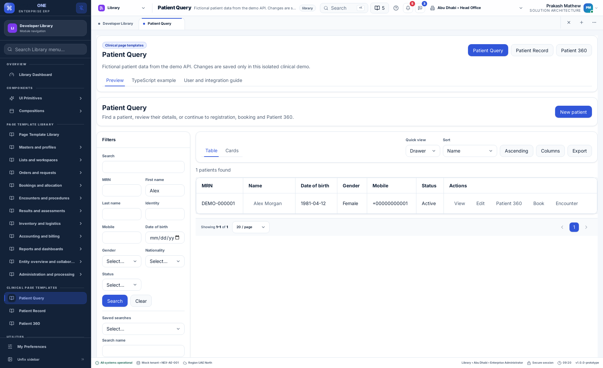
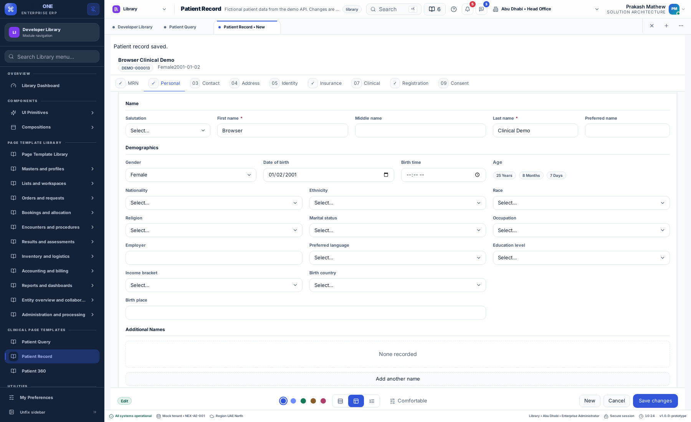
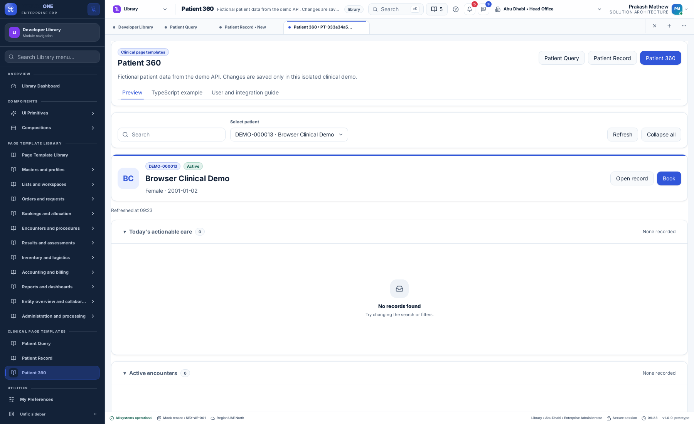
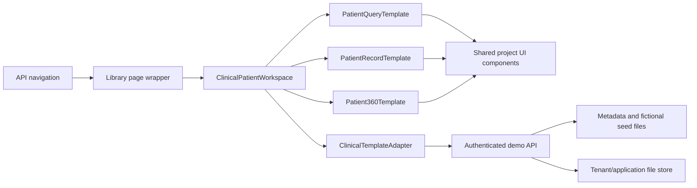

# Clinical page templates: user and integration guide

9 September 2026

Three new Library templates adapt Allyvora's Patient Query, Patient Record and
Patient 360 pages to this project's shared component library. They follow the source
page structure and main workflows while using this project's themes, preferences,
localization and navigation. They do not copy the original monolithic components.

## Open the templates

In **Library → Clinical templates**, open:

| Template | Page ID / route | Purpose |
| --- | --- | --- |
| Patient Query | `allyvora-patient-query` | Find patients and open their record or overview |
| Patient Record | `allyvora-patient-record` | Register, review and edit a patient |
| Patient 360 | `allyvora-patient-360` | Review related care and start a demo booking or encounter |

Each page includes **Preview**, **TypeScript**, and **Guide** tabs. The TypeScript tab
contains a copyable integration example. Existing component and page-template groups
remain available.

The API seeds twelve fictional patients per tenant/application. Never enter real
patient data into the demo. Administrator accounts can save; other authorized demo
accounts can read. The API enforces write permission independently of disabled buttons.

## Patient Query



1. Enter a name, MRN, identity number or other filter. Filters combine together.
2. Select **Search**. Sorting and pagination run on the API.
3. Switch between table and cards, choose table columns, or inspect quick details.
   Quick details support a drawer, modal or inline panel.
4. Save a named search to reuse its filters. Saved searches belong to the signed-in
   user within the tenant and application.
5. Open the record in view/edit mode, open Patient 360, or start a new registration.
6. Export matching rows after the shared sensitive-data confirmation. The API records
   the export actor, timestamp and result count; the shared export utility creates CSV.

## Patient Record

The record composition has since been aligned with the Allyvora source layout.
See [Patient Record alignment](patient-record-parity.md) for the revised rail, field
groups, footer, screenshots and integration details.



The record has nine sections: MRN, Personal, Contact, Address, Identity, Insurance,
Clinical, Registration and Consent. It includes repeatable alternate names, contacts,
addresses, related people, identifiers, document references, insurance policies,
disabilities, consents and communication preferences.

Choose the form navigation preference to use a rail, tabs or wizard. Values remain
in memory when moving between sections. A summary and recent history help identify
the current patient. Review the whole record before confirming a save.

The API validates required fields, email/date formats, allowed options, duplicate
identifiers, duplicate primary contacts/addresses and communication purposes. Errors
return to the relevant section without clearing values. A recoverable failed save
can be retried with the same operation ID. The API commits the master and children
atomically and protects against stale record versions. Loading the latest record
requires confirmation before replacing local edits.

Discard and template navigation actions warn about unsaved edits. Browser unload also
warns. This is in-memory recovery, not durable draft storage or a guarantee against
all shell tab-close actions. Application integrations must connect the existing draft
service with tenant retention and sensitive-field exclusions before enabling persistence.

Insurance eligibility is explicitly a **demo check of a saved policy's expiry**.
It does not contact an insurer or determine actual coverage. Save policy changes first.
Document rows store metadata/references; they do not upload or scan files.

## Patient 360



Select a patient, refresh their overview and expand individual panels or all panels.
Thirteen sections cover today’s actionable care, active encounters, upcoming
appointments, active episodes, pending orders, recent encounters, clinical information,
insurance, billing, pharmacy, care team, location and quick actions. Document and
consent counts appear in quick actions. Longer lists open in a shared modal.

Book an appointment or create an encounter using a provider, date, time and note.
The demo API persists the result and rejects an occupied provider/time slot. Demo
booking timestamps use UTC. Clinical decisions, prescriptions, order fulfillment,
billing posting and external systems are outside this demo's contract.

## Architecture



| Location | Responsibility |
| --- | --- |
| `packages/erp-config/src/clinical-templates.ts` | Serializable TypeScript contracts and template IDs |
| `packages/erp-data/src/clinical-templates.ts` | Replaceable typed adapter and HTTP implementation |
| `packages/erp-screens/src/clinical-templates/` | Separate page compositions, field/collection editor, banner, summary, booking and insurance check |
| `dummy-api/clinical-template-store.ts` | Validation, authorization, scoped storage, versions and idempotency |
| `dummy-api/config/clinical-templates/metadata.json` | Sections, field types, options, collections and providers |
| `dummy-api/config/clinical-templates/patients.json` | Fictional seed patients |
| `dummy-api/config/navigation/nexora.json` | Backend Library sidebar entries |
| `dummy-api/config/localization/shared/{en,ar,hi,ml}.json` | Canonical page and field translations |

Compositions reuse `@pepbits/ops-ui` cards, grids, tables, inputs, selects, checkboxes,
textareas, tabs, badges, dialogs, descriptions and recovery messages. Shell and
application services supply identity, requests, preferences and navigation. Components
contain no fixture patient lists, API credentials or direct network calls.

## Integrate another application

Mount the workspace inside the existing application providers for localization,
preferences and design tokens. Supply an authenticated request function and a stable
scope key that changes when tenant, application, user or record changes.

```tsx
import React from 'react';
import { ClinicalPatientWorkspace } from '@pepbits/erp-screens';
import { createClinicalTemplateAdapter } from '@pepbits/erp-data';
import type { UserPreferences } from '@pepbits/erp-config';

type Props = {
  request: (path: string, init?: RequestInit) => Promise<Response>;
  productId: string;
  scopeKey: string;
  preferences: UserPreferences;
};

export function PatientPage(props: Props) {
  const adapter = React.useMemo(
    () => createClinicalTemplateAdapter(props.request, props.productId),
    [props.request, props.productId],
  );
  return (
    <ClinicalPatientWorkspace
      adapter={adapter}
      scopeKey={props.scopeKey}
      preferences={props.preferences}
      initialPage={{ view: 'query' }}
    />
  );
}
```

Use `view: 'record', patientId, mode: 'view' | 'edit'` for existing records, or
`view: 'overview', patientId` for Patient 360. Supply `onOpen(destination)` to integrate
with application routes or MDI navigation. The Library uses browser tabs on the web
shell and workspace tabs on the desktop shell. Without it, navigation stays within the
workspace. Changing `scopeKey` resets component state and ignores late loads.

For a real backend, implement `ClinicalTemplateAdapter` using that backend's endpoints.
The UI does not require the demo action protocol. Map domain IDs and enumerations to
the contracts, return localization keys for field errors, and retain server-side
permissions, version checks and idempotency. Add approved navigation entries for each
application; the demo endpoint requires access to the registered clinical query page.

### Demo API contract

All actions use authenticated `POST /clinical-templates`, a JSON body and
`X-Product-Id`. Tenant and user come from the session, not caller-supplied patient data.

| Action | Input / result |
| --- | --- |
| `metadata` | Schema and `canWrite` |
| `search` | Filters, sort and page → rows and total |
| `new` / `load` | Empty record / record by ID |
| `save` | Record, expected version, operation ID → committed record |
| `overview` | Patient ID → patient and related care rows |
| `saved-searches` / `save-search` / `delete-search` | User-scoped filter presets |
| `export` | Filters → matching rows and server audit entry |
| `schedule` | Patient, kind, provider, date, time, notes, operation ID |
| `eligibility` | Saved patient and insurance IDs → demo expiry result |

Invalid requests use 422, denied writes 403, missing records 404, and version/slot
conflicts 409. The request adapter integrates with existing recovery/session handling.
The isolated `clinical-templates.json` store writes atomically; it is not a production
clinical database. Production needs transactional persistence, governed auditing,
retention, encryption, access controls and domain-specific validation.

## Source correspondence and remaining integration work

Source reference: `allyvora-platform/frontend/provider-web/apps/portal/src/app/t/`
with `patient-query.tsx`, `patient-management.tsx` and `patient-360-live.tsx`.
No Allyvora source files were changed. Existing screens here retain their behavior;
shared registries, exports, API routing and language catalogs have additive entries.

The main desktop compositions and demo workflows are implemented. This is an
adaptation rather than a pixel-identical clone: original keyboard shortcuts, dynamic
DCP governance, actual uploads and external clinical/insurance services are not fully
reproduced. Native-speaker review of Arabic, Hindi and Malayalam remains pending.
See `clinical-template-translation-review.csv` for the review inventory.

## Verification

- Six component/adapter/data-selection tests: retained edits, retry identity, read-only access,
  scope reset, stale-load isolation, structured API errors and today/upcoming/closed-care filtering.
- Six API tests: combined filters, atomic persistence, retry safety, validation,
  version conflicts, tenant/application/user isolation, booking conflicts and eligibility.
- Browser suite: `e2e/clinical-templates.ts`; exercises search, quick view, saved search,
  registration with injected failure, booking, CSV, localization and RTL.

Remote CI run **34334589887** passed all six jobs for implementation commit
`42851f629946d9b00d77ccb1d05b39bcd3bdf6d3`: 1,467 tests across 97 files,
61 existing API tests, six clinical API tests, registry and deployment lifecycle tests,
both builds, property checks, browser suites and native Linux lifecycle/localization.
The clinical browser workflow also passed locally after the final care-filter correction.

Release **20260909092513312-089c0a69** was prepared and smoke-tested in isolation,
then activated on both demo sites. The previous release and an API source/data backup
were retained. Public checks passed for API metadata/search/load/overview, view-record
navigation, all thirteen overview panels and absence of browser runtime errors.
The public verification performed no patient, booking, saved-search or export mutations.

- Web: https://front-design.pepbits.com/library/allyvora-patient-query
- Desktop browser shell: https://desktop.front-design.pepbits.com (Library → Clinical page templates)

Native CI covers the framework lifecycle and localization; the new clinical workflow
was exercised in Chromium. Native-speaker wording approval and real clinical-service
integration remain pending as described above.
