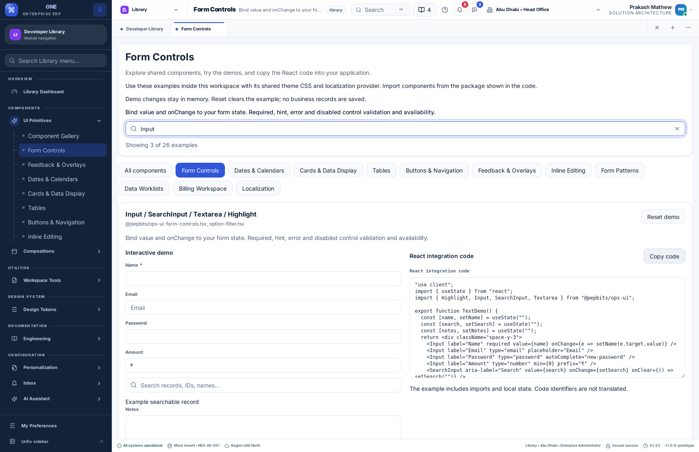

# Component Library — user and integration guide

Open **Library → Components → UI Primitives → Component Gallery**. The gallery is a searchable index; the sidebar and group buttons open dedicated pages. Search accepts component names such as `MultiSelect`, `Calendar` or `Table`, and source filenames.

## What is included

| Page | Shared components and behavior |
| --- | --- |
| Form Controls | Text, email, password, number, search, textarea, highlight, validation, select, searchable select, multiselect, checkbox, radio, toggle, range, file picker and reference-list recovery |
| Dates & Calendars | Date, time, local date/time, month, week, date range and keyboard-accessible calendar |
| Cards & Data Display | Cards, card grids, card sections, statistics, avatars, badges, formatted values and description lists |
| Tables | Semantic table building blocks with compact/comfortable density, stripes, borders, captions, footer and sticky header |
| Buttons & Navigation | Button variants, icon buttons, tabs, segmented controls, dropdowns, action menus, navigation links and pagination |
| Feedback & Overlays | Modal, drawer, record card, confirmation, empty/error/access/conflict/session/loading states, skeletons and recovery notice |
| Inline Editing | Text, number, select, date and status editors with commit and validation callbacks |
| Form Patterns | A composed form using shared inputs, required validation and local submission |
| Data Worklists | The actual shared DataTable with selection, sorting, preview and inline editing |
| Billing Workspace | A local quantity/price/total composition using shared controls |
| Localization | The shared translation provider, localized text and locale-aware display |

All 75 publicly exported React components in `@pepbits/ops-ui` are represented. A coverage test checks this against the source exports. `DataTable` is also demonstrated from `@pepbits/erp-screens`. This is a UI catalog: full domain services, AI administration and application-shell controllers are not standalone form controls. The billing example is not a complete tax or payment engine.

## Try a demo and use its code

1. Open a group and find the component.
2. Change values, select options, open overlays or try table actions in **Interactive demo**.
3. Read the guidance above the demo and inspect **React integration code** beside it. The example includes imports, state and event handlers.
4. Choose **Copy code**. If the clipboard is blocked, focus the code field to select it and copy manually.
5. Paste into a `.tsx` file inside a product in this workspace. Render the exported example function, then adapt its state and callbacks to your application.
6. **Reset demo** recreates that example. Demo changes are held in React memory and do not save business records, drafts, attachments or approvals. File selection displays a filename without uploading the file. Navigation buttons change Library pages only.

There are 26 examples. The code is generated from the actual compiled demo functions, rather than maintained as a separate illustrative snippet. It includes only the imports the example uses. Component names and TypeScript source remain in their original form when the UI language changes.



## Integration requirements

These packages are private workspace packages, not published npm packages. Add the appropriate dependency to a product workspace and use its existing build setup:

```json
{
  "dependencies": {
    "@pepbits/ops-ui": "*",
    "@pepbits/erp-config": "*",
    "@pepbits/erp-screens": "*"
  }
}
```

Use `@pepbits/ops-ui` for primitives; `@pepbits/erp-screens` exposes larger compositions such as `DataTable`. Add only the packages your product uses. React, React DOM, the configured Tailwind build and shared theme tokens are required. In a new shell, follow `apps/desktop/src/globals.css`: import Tailwind and `@pepbits/tokens/tokens.css` before the Tailwind `@source` declarations for shared package directories. Copying only a component file omits this styling setup.

The current shell supplies localization, product, navigation and preference providers. Primitive examples can run with the default English UI provider; use the application's `LocalizationProvider` for other languages and direction. Keep API identifiers and user-entered values unchanged. When integrating `DataTable`, replace sample rows and formatters with your product's data and preference-aware formatters. The caller must enforce permissions and persistence; a local `onCellCommit` callback is not backend authorization.

For record submission, drafts, imports, approvals or related-record panels, connect the existing adapters through `ProductServicesProvider`. See [shared drafts](shared-draft-recovery.md), [CSV imports](csv-import.md), [approvals](approvals.md) and [product development](desktop-development-plan.md). Preserve server validation, version checks and retry identity when replacing demo callbacks.

## Architecture and adding components

- `erp-config/src/navigation.ts` declares supported Library pages.
- `dummy-api/config/navigation/nexora.json` supplies sidebar nodes. New entries use stable page/menu IDs and localized keys. Products without the Library module do not automatically gain its pages.
- `erp-screens/src/library/catalog.ts` maps groups to demo IDs, public export names and source files.
- `demos.tsx` renders real shared exports with isolated local state.
- `component-catalog.tsx` supplies search, group navigation, previews, code copying and reset.
- `scripts/library/generate-examples.mjs` extracts self-contained examples into `examples.generated.json`. `verify:library` rejects stale examples.
- Catalog UI copy lives in `dummy-api/config/localization/shared/{en,ar,hi,ml}.json`, under `catalog.*`. Product menu/page titles live in the Nexora catalogs. Generated offline fallbacks include these keys.
- Dedicated localized Library page help is stored in the documentation manifest. Native-speaker sign-off remains pending; review sheets are in `docs/localization-review/component-library-*-review.csv`.

To add a shared component, export it from the shared package, add a self-contained exported demo function, register it in `catalog.ts`, and add localized guidance. Run `npm run library:sync` and `npm run localization:sync` from `desktop-clients`. For a new group, also add the supported page, API menu entry, localized titles and page guide. The inventory test will fail when an exported UI component lacks a catalog entry.

## Verification

Component tests cover export coverage, search/reset, actual code copying, blocked clipboard fallback, product-aware navigation and input-preserving recovery. The browser suite checks every group, overlays, tables, accessibility and the absence of business-write requests. The existing calendar regression checks date/time input, keyboard navigation and direction in English, Arabic, Hindi and Malayalam.

Local validation passed: 1,450 unit tests, API/deployment checks, both production builds and repository verification. The isolated catalog browser suite passed, including sorting, inline edits and zero business-write requests. Calendar interaction and direction checks passed in all four languages.
