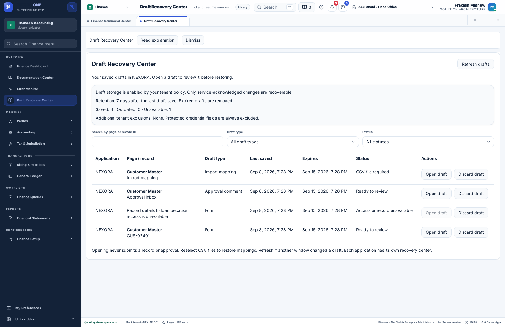

# Draft Recovery Center

Open **Draft Recovery Center** from the sidebar or the command palette. It lists your acknowledged drafts in the current application. Each application has a separate center so draft values and navigation never cross application boundaries.

## Find and continue unfinished work

The table shows the application, page and record, draft type, last-saved time, expiry and status. Search by page or record ID. Filter by Form, Import mapping or Approval comment, and by status. Results are newest first and paginated in groups of 25.

- **Ready to review:** open the workflow, then choose Restore or Discard.
- **Source changed — review required:** the saved record version, approval context or draft format changed. The existing workflow requires review and validation before submission.
- **CSV file required:** open the import dialog and reselect a CSV with matching headers. The center does not store or download CSV contents.
- **Access or record unavailable:** the page is no longer accessible, the record is unavailable, or the draft belongs to an unsupported workflow. Page and record details are hidden. Open is disabled, but the owner can discard the draft.

Open rechecks access and the draft revision on the API. Forms open through normal application navigation. Imports and approvals open their shared dialogs directly from the center. No action is automatically restored, saved, imported or approved. Inbox comment drafts do not restore bulk selections.

Discard removes only the selected user's recovery draft. It never deletes the saved record or another user's draft. Concurrent changes produce a conflict and require Refresh. Retrying a failed discard keeps the same operation ID; a lost success response can be retried safely. Expired drafts disappear after retention enforcement.

The policy summary shows whether service storage is enabled, the retention period, draft counts and additional field exclusions. Only changes acknowledged by the service survive reopening. Unsaved offline work is still held in memory. Tenant administrators manage policy under **My Preferences → Preference policies → Draft recovery policy**.

## API and integration

`POST /draft-center` accepts an authenticated bearer token and `X-Product-Id`. The backend derives tenant and user identity from the session.

| Action | Request fields | Result |
| --- | --- | --- |
| `list` | Optional `query`, `kind`, `status`, `offset` | Metadata rows, filtered count, effective offset, policy and status counts |
| `open` | Opaque `id`, `version` | A fresh, access-checked workflow descriptor |
| `discard` | Opaque `id`, `version`, stable `operationId` | 204 after the owner's revision-checked draft deletion |

Search is sent in a POST body rather than a URL. List and open responses contain no form values, comments, CSV contents or filenames. Inaccessible rows hide page and record identifiers before search and filtering, so searching cannot reveal those identifiers. An opaque ID is still scoped to the authenticated owner; another account cannot use it to open or discard the draft.

Applications may inject `ProductServices.draftCenter` implementing `DraftCenterAdapter`. Custom adapters must provide the same owner/application isolation, value-free metadata, access recheck and revision/idempotency guarantees. The existing `DraftAdapter` and `RecordAdapter` remain responsible for restoring and saving actual workflow data.

The implementation uses the current service draft engine. See [shared draft recovery](shared-draft-recovery.md) for storage, policy, conflict and integration contracts. Adding a center does not convert the demo JSON store into a multi-host production database or replace demo authentication.

## Production integration and translation review

The production database and deployment environment have not been selected in this thread. Connecting production storage remains pending that information. The application-facing contracts are implemented and tested; the target backend must enforce transactions across draft revisions, business saves and operation receipts, expiry, tenant authorization, policy changes and backup retention. A production adapter must also return record-level access decisions rather than relying only on menu availability.

Arabic, Hindi and Malayalam copy is supplied, and the center's page guide is localized. Native-speaker sign-off remains pending an actual reviewer. The review files are `docs/localization-review/draft-center-{ar,hi,ml}-review.csv`; existing shared-draft wording is in `drafts-{ar,hi,ml}-review.csv`. Reviewers should check the table, status labels, restore/discard wording and policy descriptions in context, then enter their name and corrections. No automated check is described as native-speaker approval.

## Verification

Backend tests cover metadata privacy, scope isolation, unavailable-record redaction, changed source versions, expiry, pagination and stale/idempotent discard. Component tests cover filtering, navigation, inaccessible-row actions and retry identity. The browser suite `e2e/draft-center.mjs` opens form, import and approval workflows, verifies durable discard and checks accessibility against an isolated API.

The first remote run passed the center, browser, navigation and product checks but exposed a controlled native-panic fixture failure: the panic hook ran, then the process exited with SIGSEGV instead of the fixture's expected exit code. The debug-only trigger now invokes the real panic hook and terminates with an intentional abort. The test requires SIGABRT, the synthetic panic log, a surviving marker, authenticated delivery after restart and marker acknowledgement. Core dumps are disabled for the fixture. [Rust documents abort as abnormal termination without normal exit cleanup](https://doc.rust-lang.org/std/process/fn.abort.html).

A local diagnostic retest initially used a development native build pointing at the demo API and recorded a synthetic Sentinel incident there; it did not change business records. The fixture now guards authentication and monitoring requests against API-target mismatches. The correctly packaged isolated native test passed twice consecutively after the correction. Use the Tauri build command for this test, not a plain Cargo development build.
