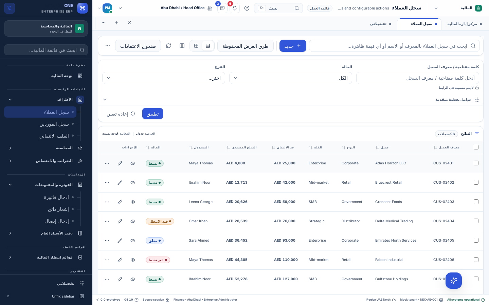

# Localization: user and integration guide

Implemented on 8 September 2026 for the shared desktop-first frontend.

The signed-in applications now load menus and language dictionaries from the dummy
API. The editable source is `dummy-api/config/navigation/` and
`dummy-api/config/localization/`; the bundled `locale-messages.ts` remains a
compatibility fallback. See the [backend implementation guide](./backend-navigation-implementation.md)
for the bootstrap flow and file examples. The [page-body guide](./page-body-localization.md)
covers the expanded screen translations, checks and integration boundaries.

## Change the language

Open **My Preferences → Language & help → Language**. The options show their native names:
English, العربية (Arabic), हिन्दी (Hindi), and മലയാളം (Malayalam).
The language selector is available in Preferences only; it is not shown in the header.

The interface updates immediately. The existing preferences service saves your
choice after a short debounce and restores it when you sign in again. Changing
language does not close your record or discard typed form values. If preferences
could not be loaded, the existing preference persistence guard prevents an
accidental overwrite; saving preferences requires a working preferences service.

Arabic changes the document direction to right-to-left. Your choice of a
physically left or right sidebar is respected. Shared input adornments and
navigation indentation follow the reading direction.

Currency, decimal precision, numeric locale, date order, and 12/24-hour clock
remain separate preferences. Language changes localized month names and AM/PM
labels. Record-panel and approval timestamps use the selected language's locale.

## What is included

- A shared English/Arabic/Hindi/Malayalam message catalog and English fallback.
- Live language selection and persistence through the existing preferences API.
- Shared button, field, select, tab, card, status, dialog, and menu labels.
- Configured navigation and page headings, translated navigation search, table
  headings, form labels, common validation messages, and workspace page titles.
- Core CSV import labels, column mapping labels, result counts, confirmation copy,
  progress states, and retry controls.
- Core approval labels, status displays, configuration controls, comments, history
  actions, and notification counts.
- Attachment, comment, related-record, and activity panel interface copy.
- Per-product translation overrides without copying shared components.

This is a shared localization implementation, not a claim that every sentence in
every demo application has been translated. See the remaining work below.

## Architecture and flow

```text
Product definition (optional translation overrides)
                     ↓
ERPProvider ← preferences API → saved language (en/ar/hi/ml)
    ├─ document.lang + document.dir
    ├─ translation resolver + value formatters
    └─ LocalizationProvider (@pepbits/ops-ui)
         ├─ shared controls
         ├─ navigation / workspace
         └─ forms / worklists / imports / approvals / record panels
```

`erp-config/src/i18n.ts` resolves messages and interpolates named values.
`erp-config/src/locale-messages.ts` loads generated fallback catalogs from `erp-config/src/locales/`. English is immediate; other fallbacks load on demand.
`ops-ui/src/localization.tsx` defines a React context that is independent of ERP
configuration. Generic UI consumers outside the ERP shell default to English.
`erp-shell/src/erp-context.tsx` connects the product, preferences, translations,
and locale-aware timestamp formatting.

Messages use English source text as their keys. Resolution order is:

1. The product's selected-language override.
2. The shared selected-language message (including legacy short keys).
3. The product's English fallback, then shared English.
4. The original key when no translation exists.

Unknown languages passed to the resolver use English. Persisted preferences are
also sanitized by the existing preference loader. React renders translations as
text; catalog values are never inserted as HTML.

## Integrate a different SaaS application

Pass translations through the existing product definition:

```tsx
import { defineProduct } from '@pepbits/erp-config';

export const product = defineProduct({
  id: 'accounts',
  name: 'Accounts',
  tagline: 'Your accounts workspace',
  defaultModule: 'finance',
  enabledModules: ['finance'],
  translations: {
    ar: { 'Customer Master': 'سجل العملاء' },
    hi: { 'Customer Master': 'ग्राहक सूची' },
    ml: { 'Customer Master': 'ഉപഭോക്തൃ പട്ടിക' },
    en: { 'product.welcome': 'Welcome to Accounts' },
  },
});
```

Use that product with the existing `ProductProvider` outside `ERPProvider`.
No additional provider is needed inside the normal enterprise shell. When using
ops-ui independently, supply its `LocalizationProvider` with `language`,
`direction`, `t`, and `dateTime`; the standalone host owns its document direction.

For new screen copy:

```tsx
import { LocalizedText, useLocalization } from '@pepbits/ops-ui';

function ImportSummary({ count }: { count: number }) {
  const { t } = useLocalization();
  return <>
    <LocalizedText message="Validation and import results" />
    <p>{t('Import valid rows: {count}', { count })}</p>
  </>;
}
```

Add one entry for each supported language. Keep `{count}` or other named
placeholders identical across translations. Translate a whole sentence instead
of joining independently translated fragments. Count labels avoid assuming an
English singular/plural rule; this implementation does not parse ICU plural
messages. Product copy needing grammatical plural variants should select an
explicit message using `Intl.PluralRules` and supply all relevant variants.

If a product changes an English page title, add translations for its new title.
Keep page IDs, route IDs, permission roles, field IDs, and option values stable.
For new layouts, use logical spacing/alignment (`ms`, `me`, `ps`, `pe`,
`text-start`) and test both directions.

## Data and API integration

Localization changes display labels. It does not translate business record
names, comments, filenames, IDs, saved option values, CSV source headers, or API
payloads. A translated status label still submits the original status code.
CSV error-report exports retain their stable English headers and original values.
CSV parsing and numeric inputs continue to expect their existing machine formats;
localized digits and locale-specific decimal separators are not a new CSV format.

The existing preferences adapter must support loading and saving `language` using
one of the four supported codes. No new backend route is required. Arbitrary
backend error messages fall back to their original text. Known required, numeric,
and email validation messages are translated at the UI boundary. For a production
adapter, prefer stable error codes plus parameters and map them to product
messages instead of relying on English server prose.

## Remaining work for each product

- Translate domain-specific dashboards, report descriptions, long help text,
  clinical terminology, and remaining legacy screen copy that still falls back
  to English. The login screen is outside the signed-in language provider.
- Translate any application-specific backend errors and generated notification
  prose. User-entered stage names, comments, and record names remain unchanged.
- Review Arabic, Hindi, and Malayalam terminology with native-speaking product
  owners before treating the copy as final.
- Add further languages by extending `LanguageKey`, preference validation,
  language options/locales, and all catalogs; then test their direction and fonts.
- If required, add localized export templates, plural-message tooling, and
  locale-aware CSV number parsing as explicit product features.

## Verification

Run from `desktop-clients` with the repository-supported Node version:

```sh
npm run typecheck
npm test
npm run build
npm run verify
node e2e/localization.mjs
```

The browser script uses `E2E_DESKTOP` (default `http://127.0.0.1:3109`) and the
existing Playwright harness. Run it against an isolated demo API. It intercepts
preferences, checks four languages and both physical sidebar placements, checks
record identifiers, checks that the header has no language selector, and reloads the saved
language. Its screenshot is written to `/tmp/localization-ar.png`.

Unit tests cover catalog parity, interpolation tokens, fallback, product
overrides, known field errors, month localization, explicit currency preferences,
and preservation of editable values and option codes while labels change.

## Desktop screenshot

Arabic customer worklist, with the sidebar explicitly kept on the left:



This screenshot also shows the intended boundary: customer names and stored
business values remain in their original language.

Verification results on 8 September 2026:

- 1,345 unit/component tests passed; 33 affected regression tests passed again
  after the final spacing correction.
- All package typechecks, both production builds, and repository verification
  checks passed.
- Browser checks passed for all four languages, both sidebar placements,
  preference reload, and form draft preservation.
- CSV import and approval end-to-end suites passed against isolated demo data.
- Prepared release: `20260908050509718-58e100a7`.
- Release activated successfully; public language switching passed on both
  `front-design.pepbits.com` and `desktop.front-design.pepbits.com` with preference
  writes intercepted during the smoke check.

Follow-up: language selection moved exclusively to Preferences in release
`20260908051857534-e562a217`. Package typechecks, both packaged builds, all four
languages with both sidebar placements, preference reload, and public checks on
both frontends passed. The screenshot above reflects the header without a
language selector.

See [on-demand catalog loading and failure behavior](review-follow-up-2026-09-08.md#language-loading-and-bundle-size) for the current bootstrap and standalone integration contract.
