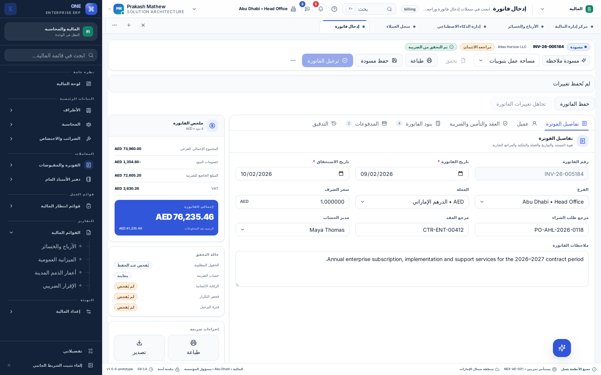

# Page-body localization

The shared frontend has a catalog-based translation pass for English, Arabic,
Hindi and Malayalam. Choose **My Preferences → Language & help**. The sidebar,
header and page content use the same preference. Switching language keeps open
records, unsaved input, selected options and record identifiers intact.

## Where the text lives

The authoritative files are:

- `dummy-api/config/localization/shared/en.json`: English source and message keys.
- The adjacent `ar.json`, `hi.json` and `ml.json`: translated display text.
- `dummy-api/config/localization/products/<product>/<language>.json`: product overrides.

Existing page, field, section and column keys continue to work. Shared screen
copy also uses stable `ui.*` keys. Some older components still pass an English
source-message key; that key is resolved through the same catalog. An English
identifier in source code is not necessarily English text shown on screen.

The API combines shared messages and product overrides. Authenticated application
bootstrap loads the dictionaries, and `ERPProvider` supplies the selected
language to the shared `LocalizationProvider`. Pages call `t(key, values)` or
render `LocalizedText`. No DOM text replacement or third-party translation
service is involved.

## What the pass covers

- Schema forms: sections, field labels, hints, placeholders and validation.
- Worklists: controls, column labels, filtering, selection, previews and empty states.
- Dashboards: headings, KPI labels, comparison notes and month labels.
- Billing: section headings, totals, controls, validation labels and print headings.
- Consultation: builder options, questions, examination labels, instruments,
  explanatory notes, review captions and recording controls.
- Reports: filters, headings, summary text, scheduling and delivery messages.
- Spreadsheet: column headings, toolbar, accessible cell names and import messages.
- Attachments, comments, related records, activity, CSV imports and approvals:
  interface controls and explanatory copy, including approval confirmations.
- Preferences, the component library, AI administration and shared dialogs.
- Shared controls: translated option labels and searching, status displays,
  feedback, loading/error states and accessible labels.

Counts are translated as whole messages rather than adding an English `s`.
Dynamic values use named placeholders. Common parser and validator errors are
localized at the display boundary. Approval notices translate their surrounding
sentence while preserving administrator-entered stage names.

## What stays as data

Customer names, descriptions entered into records, comments, transcripts, AI
responses, imported CSV headers/cells, configured stage names, IDs, codes and
literal date-format examples retain their original content. Dashboard activity
payloads and other service-returned content can also remain in their source
language; product adapters should provide message keys and parameters when that
content is intended to be localized. Unknown service errors remain readable as
returned rather than being silently discarded.

Billing previously used captions as saved field identifiers. Those legacy keys
remain stable. Consultation review checkboxes now have an explicit `fieldKey`,
so translating their captions cannot reset a recovered draft. Option values,
CSV mappings, query values and API payloads do not become translated strings.

Before authentication, the sign-in screen uses the standalone English fallback:
the account language preference is loaded after sign-in.

## Adding or changing copy

1. Reuse an existing key or add a stable key and English text to `shared/en.json`.
2. Add the same key to Arabic, Hindi and Malayalam. Preserve named placeholders.
3. Render the key through `LocalizedText` or `t`; do not translate saved values.
4. For product-specific terminology, override the same key in the product catalog.
5. Run `npm run localization:sync` from `desktop-clients`, then
   `npm run verify:localization` and the relevant component tests.

The sync command generates `erp-config/src/locale-messages.ts` and the standalone
English fallback `ops-ui/src/messages.en.ts`. Do not edit generated files directly.
The fallback excludes the thousands of per-page navigation/schema aliases loaded
by bootstrap. Normal signed-in pages use the API catalogs first.

For a copy-only change to an existing key, restarting the API and reloading the
client updates the display without rebuilding either frontend. New components
or new references in source code require a frontend build.

## Verification and limits

`verify:localization` checks every English catalog key for a counterpart in the
other three languages, matching placeholders, and unexpected English copies.
It also parses JSX in the four UI packages to reject raw static interface text
and missing static presentation keys, including hardcoded wording in dynamic
presentation attributes. Reviewed technical/data exceptions are
listed in `scripts/localization/copy-exceptions.json` with reasons. New exceptions
should describe real data or code, not hide unfinished interface translations.

This is a static-copy check, not proof that arbitrary text returned by every
possible product adapter is translated. Native-speaker terminology review remains
appropriate before customer release, particularly for clinical terminology.

`e2e/page-body-localization.mjs` exercises representative page bodies and dialogs
in all four languages against an isolated local API. `e2e/localization.mjs`
checks preference changes, reload, both sidebar positions and stable record IDs.
The component tests cover translated searching, stored values, recovery behavior,
complete error messages and standalone English fallback.

## Validation on 8 September 2026

- Catalog audit: 13,790 keys across the shared and product catalogs, with all four
  languages present, matching placeholders and reviewed data/code exceptions.
- Full component suite: 80 files, 1,357 tests passed. A preference-style assertion
  now waits for its asynchronous effect before checking the result.
- Browser checks: dashboard, billing and print, composed consultation, spreadsheet,
  reports, AI administration, CSV upload and approval inbox in all four languages.
- Preference checks: all four languages with left and right sidebar placement,
  reload persistence and unchanged record IDs.
- TypeScript checks and web/desktop production builds passed.

The attached Arabic billing screenshot is from the isolated browser check. Its
English customer details and notes demonstrate that display translation does not
rewrite business content.

Release `20260908081742242-fb52a1fa` is active on both demo sites. Public browser
checks passed for Arabic, Hindi and Malayalam billing page bodies on both the
web and desktop URLs, with no runtime errors or unresolved message keys.
The final worklist/preference regression run passed another 134 tests after the
last confirmation-message edits. Repository verification and API configuration
tests also passed.

The follow-up [deployment and verification report](localization-completion-report.md)
covers backend message descriptors, localized output files, Firefox/WebKit and
native Linux testing. Human language approval remains pending in the
[review pack](localization-review/README.md).
