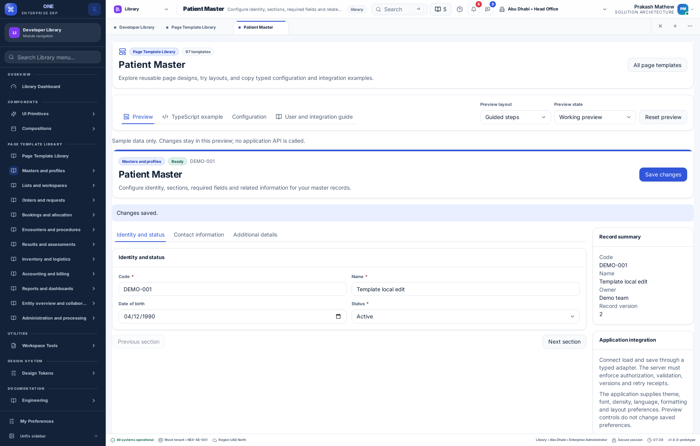
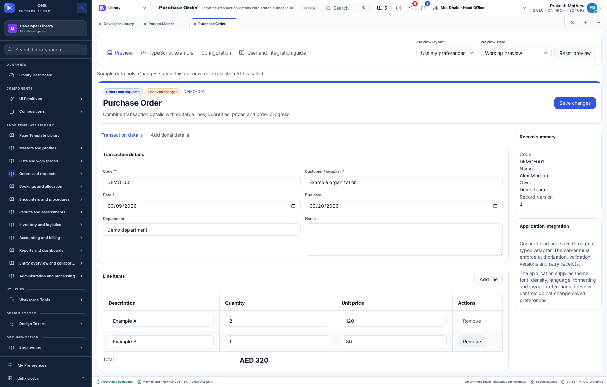
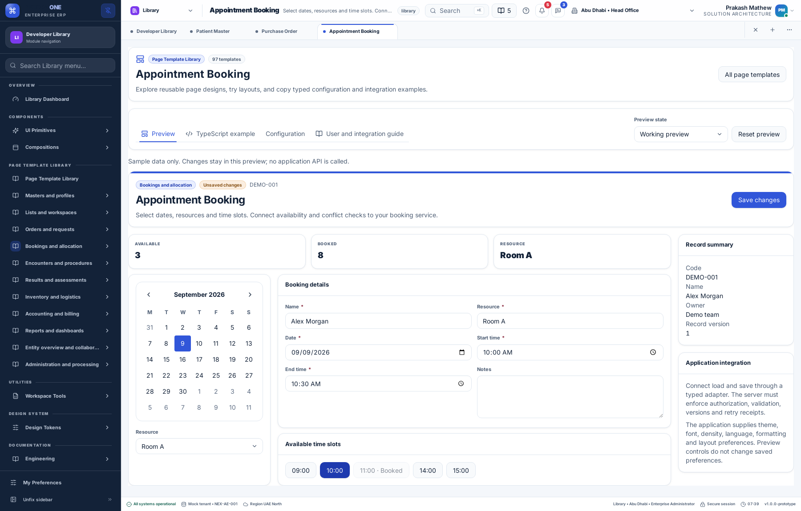
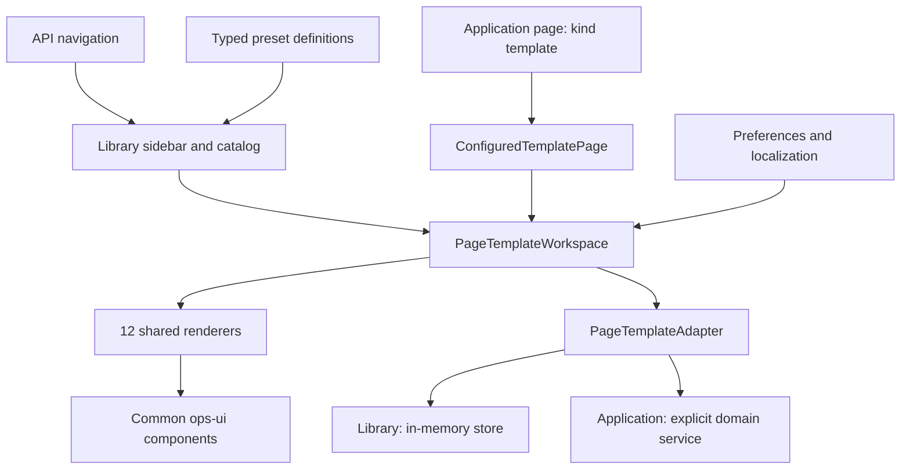

# Page Template Library — User and Integration Guide

9 September 2026

The Library provides 97 desktop page presets in 11 groups for ERP, healthcare, education and other applications. They use 12 shared TypeScript renderers and the existing common UI components.

## Using the Library

1. Open **Library → Page Templates → All page templates**. The backend navigation configuration supplies this section and all grouped items.
2. Search by page name or application, or choose a sidebar group.
3. Open a template. **Preview** is interactive; **TypeScript example** contains copyable source; **Configuration** shows the typed definition; **Guide** explains integration.
4. Try rail, tabs or wizard layout on form templates. The initial layout follows preferences. Switching to code or changing layout preserves preview values.
5. Try loading, empty, denied, read-only and recoverable failure states. Choose failure, save, switch to ready, then Retry to see recovery without losing edits.
6. Reset restores sample data. Leaving the page or refreshing discards these demo edits.

Saving updates only the in-memory preview. Attachments record filenames locally; communication notes are not sent. The CSV demonstration previews, maps and validates rows, then adds them locally without starting a backend import.







## Supported frontend behavior

- Masters: section navigation, contact details, attributes, relationships and hierarchy editing.
- Lists: search, status filters, sorting, selection, pagination, bulk completion and record previews; card, board and split-list variants.
- Orders and vouchers: editable lines, totals and validation; journals require positive balanced debit/credit totals.
- Bookings: calendar, resource and date/time controls; schedule and occupancy views.
- Cases, result entry, timelines, entity detail tabs and local document/communication workspaces.
- Report filters, tables, grouped matrices, dashboard charts and local reconciliation selection.
- Configuration pages, permission matrices and CSV mapping.

Presets in a family deliberately share behavior. A surgery workspace is a starting layout, not a complete theatre-management system. Billing presets do not implement jurisdiction-specific tax or insurance rules.

## Preferences and localization

Shared components inherit theme, typography, contrast, reduced-motion and RTL styles. Applicable renderers consume form navigation, list density, page size, result view, decimal places and date/time/number formatting. The preview layout override does not alter saved preferences or tenant policy.

Stable `template.*` keys provide English, Arabic, Hindi and Malayalam copy. Business data, such as names and imported cells, is not translated automatically. Native-speaker wording review remains pending; review sheets are in `docs/localization-review/page-templates-*-review.csv`.

## Architecture



Definitions live in `erp-config/src/page-templates.ts`; renderers, state contracts and examples live in `erp-screens/src/templates`. Cards, fields, tabs, tables, calendars and recovery messages come from `ops-ui`. Templates do not choose API endpoints or hold credentials.

`dummy-api/config/navigation/nexora.json` supplies the overview and 97 child pages. Copy lives in `dummy-api/config/localization/shared/{en,ar,hi,ml}.json`, with generated client fallbacks. Documentation release/translation files supply dedicated page guides and guided-tour steps.

## Save and recovery flow

1. Edits update local page state.
2. Save validates required values and applicable email, number, date range, booking, hierarchy, order-line and journal rules.
3. The adapter receives tenant/application/user/page/record scope, document, expected version and operation ID.
4. Recoverable errors retain values. Retry keeps the operation ID until the payload changes.
5. Successful responses replace the local snapshot and must advance its version.
6. A conflict offers **Review latest**. Replacing local values requires explicit confirmation; no automatic merge occurs.

Scope changes remount the editor. Obsolete asynchronous results are ignored. The server must authorize requests, validate domain rules, enforce versions and retain idempotency receipts. Client scope is context, not proof of authorization.

## Integrating an application

### Render a template directly

```tsx
import { PageTemplateWorkspace, type PageTemplateAdapter,
  type TemplateScope } from '@pepbits/erp-screens';
import { TEMPLATE_BY_ID, type TemplateDocument,
  type UserPreferences } from '@pepbits/erp-config';

export function PatientPage(props: {
  scope: TemplateScope;
  initialDocument: TemplateDocument;
  adapter: PageTemplateAdapter;
  preferences: UserPreferences;
}) {
  return <PageTemplateWorkspace
    definition={TEMPLATE_BY_ID['template-patient-master']}
    {...props}
  />;
}
```

Load `initialDocument` in the parent and supply session context in scope. Without an adapter, editing is disabled. The `support` slot accepts contextual panels; `onSaved` receives acknowledged documents. The Library's complete TypeScript example provides a runnable in-memory adapter that applications should replace for persistence.

### Register an application page

```tsx
import type { PageDefinition } from '@pepbits/erp-config';
import { ProductServicesProvider, type PageTemplateAdapter }
  from '@pepbits/erp-screens';

const patientPage = {
  id: 'my-patient-page', title: 'Patient', subtitle: 'Registration',
  kind: 'template', module: 'shared',
  templateId: 'template-patient-master',
} satisfies PageDefinition;

function Application({ adapter, children }: {
  adapter: PageTemplateAdapter;
  children: React.ReactNode;
}) {
  return <ProductServicesProvider services={{ pageTemplates: adapter }}>
    {children}
  </ProductServicesProvider>;
}
```

Add this definition and its translated title keys to the application's page registry and API navigation using the existing product setup. The framework derives scope from the session/navigation target, loads through the adapter, displays loading/recovery states and respects view/create/edit permissions. Registry integration requires `load` and `save`.

For a new target, `load` receives `recordId: 'new'`; return a version-zero initial document. The first save can return the allocated ID. Subsequent saves must retain it and advance the version.

Implement the adapter with the application's authenticated request layer. Map domain DTOs into `TemplateDocument` in `load`, and map back in `save`. Forward `expectedVersion` and `operationId` to server concurrency/idempotency checks. Return structured failures recognized by shared recovery UI. No generic endpoint is installed automatically.

### Customize or add templates

Spread an existing definition and supply stable IDs, sections, columns, stages and localized labels. Use `satisfies PageTemplateDefinition`. Pass it directly to the workspace or as `page.templateDefinition`. Business rules belong in the application/server; extend shared frontend validation when reusable.

For built-in Library entries, update `PAGE_TEMPLATES`, API pages/navigation, four catalogs and page documentation. Run `npm run localization:sync` and `npm run templates:sync`, then verification. Copyable example source is generated from the demo component to prevent example drift.

## Preset inventory

### Masters and profiles

| Template | Renderer | View |
| --- | --- | --- |
| Simple Master | `master` | table |
| Detailed Master | `master` | table |
| Person Registration | `master` | table |
| Person Profile | `master` | table |
| Organization Profile | `master` | table |
| Item / Service Master | `master` | table |
| Hierarchical Master | `master` | matrix |
| Relationship Master | `master` | table |
| Configuration Master | `master` | table |
| Patient Master | `master` | table |
| Employee Master | `master` | table |
| Customer Master | `master` | table |
| Supplier Master | `master` | table |
| Student Master | `master` | table |

### Lists and workspaces

| Template | Renderer | View |
| --- | --- | --- |
| Master List | `list` | table |
| Transaction Register | `list` | table |
| Operational Worklist | `list` | table |
| Assignment Queue | `list` | board |
| Approval Inbox | `list` | table |
| Exception Queue | `list` | table |
| Board Workspace | `list` | board |
| Split List and Detail | `list` | table |
| Batch Processing Workspace | `list` | table |

### Orders and requests

| Template | Renderer | View |
| --- | --- | --- |
| Header and Line Items | `order` | table |
| Service / Test Order | `order` | table |
| Quotation / Estimate | `order` | table |
| Order Fulfillment | `order` | table |
| Return / Cancellation | `order` | table |
| Order Comparison | `order` | matrix |
| Recurring Order Setup | `order` | table |
| Purchase Order | `order` | table |
| Sales Order | `order` | table |
| Laboratory Order | `order` | table |

### Bookings and allocation

| Template | Renderer | View |
| --- | --- | --- |
| Appointment Booking | `booking` | table |
| Calendar Workspace | `booking` | table |
| Resource Timeline | `booking` | timeline |
| Capacity / Occupancy Board | `booking` | board |
| Allocation Workspace | `booking` | table |
| Roster / Timetable | `booking` | matrix |
| Waitlist and Check-in | `list` | table |

### Encounters and procedures

| Template | Renderer | View |
| --- | --- | --- |
| Patient Encounter | `case` | table |
| Service / Support Case | `case` | table |
| Admission / Long-running Episode | `case` | table |
| Procedure Planning | `case` | table |
| Surgery Workspace | `case` | table |
| Procedure Execution | `case` | table |
| Checklist Workspace | `case` | table |
| Discharge / Closure | `case` | table |

### Results and assessments

| Template | Renderer | View |
| --- | --- | --- |
| Structured Result Entry | `result` | table |
| Laboratory Result | `result` | table |
| Narrative Result / Report | `result` | document |
| Observation Chart | `result` | timeline |
| Assessment / Scoring | `result` | table |
| Result Review and Verification | `result` | table |
| Result Comparison | `result` | matrix |
| Certificate / Final Output | `result` | document |

### Inventory and logistics

| Template | Renderer | View |
| --- | --- | --- |
| Goods Receipt | `order` | table |
| Issue / Dispatch | `order` | table |
| Stock Transfer | `order` | table |
| Stock Count / Adjustment | `order` | table |
| Batch / Serial Tracking | `order` | table |
| Pick / Pack Workspace | `order` | table |
| Trip / Transport Plan | `order` | table |
| Dispatch and Tracking Board | `list` | board |

### Accounting and billing

| Template | Renderer | View |
| --- | --- | --- |
| Journal Voucher | `finance` | table |
| Payment Voucher | `finance` | table |
| Receipt Voucher | `finance` | table |
| Invoice / Billing Workspace | `order` | table |
| Patient Billing | `order` | table |
| School Fees | `order` | table |
| Credit / Debit Note | `order` | table |
| Allocation / Settlement | `reconcile` | table |
| Bank Reconciliation | `reconcile` | table |
| Budget Workspace | `order` | table |
| Period Processing | `finance` | table |
| Statement of Account | `report` | table |

### Reports and dashboards

| Template | Renderer | View |
| --- | --- | --- |
| Report Parameters | `report` | table |
| Tabular Report | `report` | table |
| Grouped / Summary Report | `report` | table |
| Pivot / Cross-tab Report | `report` | matrix |
| Document / Printable Report | `report` | document |
| Operational Dashboard | `dashboard` | table |
| Management Dashboard | `dashboard` | table |
| Analytical Workspace | `dashboard` | table |

### Entity overview and collaboration

| Template | Renderer | View |
| --- | --- | --- |
| 360° Entity Workspace | `entity` | table |
| Timeline / History | `entity` | timeline |
| Document Workspace | `entity` | table |
| Task Workspace | `list` | board |
| Communication Workspace | `entity` | table |

### Administration and processing

| Template | Renderer | View |
| --- | --- | --- |
| Preferences and Policy Editor | `admin` | table |
| Permissions Matrix | `admin` | matrix |
| Workflow Configuration | `admin` | table |
| Import Wizard | `admin` | table |
| Background Jobs Center | `list` | table |
| Schedule Configuration | `admin` | table |
| Audit / Incident Explorer | `list` | table |
| Integration Configuration | `admin` | table |

## Boundaries and pending work

The Library and typed frontend adapter integration are implemented. Production application work includes clinical rules, accounting posting/tax, scheduling capacity/time zones, real file storage, report generation/delivery, workflow execution and notifications. Reconciliation fixtures use matching sample rows; production needs independently sourced ledgers.

Recoverable errors retain unsaved values during the mounted session. The generic engine does not automatically persist durable drafts. Applications must wire existing policy-controlled draft facilities when required; sensitive fields must respect tenant exclusions.

The field contract covers text, email, number, date, time, select, textarea and checkbox. Extend shared typed renderers for additional domain widgets. The separate Component Library remains the catalog for all public UI controls.

Native-speaker review remains pending. Verification and deployment evidence is recorded below.

## Verification — 9 September 2026

- All workspace type checks passed. Production web and desktop builds passed.
- 1,461 unit tests, 61 API tests, 2 suite-registry tests and 14 deployment tests passed. The 11 new template tests include rendering/validating all 97 presets, scoped loading, permissions, recovery, conflict confirmation and financial/booking validation.
- The dedicated Chromium suite passed catalog discovery, all renderer families, edit retention across code/layout switches, failed-save retry, order lines, booking, CSV mapping, four-language/RTL display and a scoped accessibility audit. No business-data writes occurred.
- All repository verification checks passed, including common-component adoption, localization, documentation coverage, generated-example parity and bundle budgets.
- Screenshots above were captured from the tested desktop preview at 1800 × 1150.

### Remote CI and live release

Commit `d1110ed` passed all six jobs in [CI run 34325060001](https://github.com/IAMPrakashJM/enterprise-fronend/actions/runs/34325060001): core checks, browser, feature-browser, navigation, product integration and native Linux lifecycle/localization.

Release `20260909074035930-09b06741` is active on [web](https://front-design.pepbits.com) and [desktop demo](https://desktop.front-design.pepbits.com). Public checks passed on both: all 97 templates, Library navigation, master/order previews, TypeScript source, retained preview values and four-language API catalogs, with no runtime errors or business-data writes. API and both shells returned HTTP 200. The previous release and an API source/data backup were retained for rollback.
