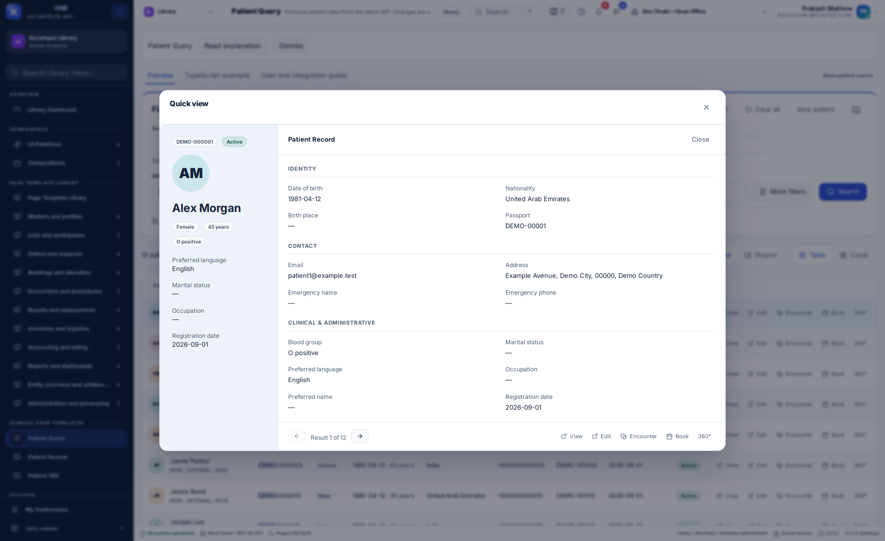

# Patient Query: Allyvora layout alignment

9 September 2026

Open **Library → Clinical page templates → Patient Query**, or
`/library/allyvora-patient-query` on the web shell.

The template now follows the local Allyvora `/patient/search` source: one full-width
search panel followed by a results toolbar and table or cards. The earlier filter
sidebar and large duplicate Library heading have been removed from this preview.
The Library's Preview, TypeScript and Guide tabs remain available.

## How to use the page

1. Enter at least one criterion. The initial page does not fetch the patient registry.
2. **Search anywhere** matches whole words across record values, alternate names,
   addresses, contacts and identifiers. Use quotes for a phrase or a leading minus
   to exclude a term. The labelled name, MRN and identifier fields accept partial values.
3. **More filters** reveals ID type, nationality, residing country, gender, birth date
   and status. Phone search combines the number with an optional dialling code.
4. Select **Search** or press Enter. Filters combine, and failures preserve them for Retry.
5. Choose table or cards. Use Columns to choose table fields; Patient remains visible.
   Name, MRN, birth date and registration column headings support API sorting.
6. Select a patient to open details in a drawer, modal or directly below the selected
   result. Previous/next moves through the current result page. View/Edit, encounter,
   booking and 360 actions retain patient identity.
7. Save a named preset to the API. Presets are scoped by tenant, application and user.
   Recent searches stay in memory for this workspace session and are deduplicated
   by normalized criteria. They are not written to browser storage.
8. Export matching rows through the existing confirmation and audited demo API.
   Pagination and totals remain server-driven.

Keyboard shortcuts: `/` focuses Search anywhere, `V` changes table/cards, `?` opens
help, and left/right move between open patient details. Escape closes details.
Typing in inputs does not trigger these page shortcuts.

## Shared components and integration

| Composition | Responsibility |
| --- | --- |
| `PatientQueryTemplate` | Search state, adapter calls, presets, export and navigation |
| `PatientQueryFilters` | Full-width basic/advanced search, saved presets and recent searches |
| `PatientQueryResults` | Shared table/cards, patient identity, matched-field badges and sorting |
| `PatientQueryActions` | One consistent set of patient navigation/care actions |
| `PatientQueryDetail` | API-loaded identity, contact and administrative groups in three presentations |
| `query-model.ts` | Filter normalization, recent-search signatures and API option selection |
| `clinical-template-search.ts` | Demo API filter and full-text matching semantics |

All inputs, selects, dates, buttons, badges, avatars, tables, cards, pagination,
drawers, dialogs and description lists use the existing shared library. Scoped CSS
controls the composition. No source Allyvora files or unrelated page layouts are changed.

Continue integrating through `ClinicalPatientWorkspace` and `ClinicalTemplateAdapter`;
the TypeScript tab contains the existing example. Business records and option lists
come from the API. `PatientFilters` adds optional `identityType`, `country` and
`mobileCode`. Summary rows add optional country, identifier, match-location and
possible-duplicate information. Metadata may supply `searchOptions`, including
stored custom countries so older records remain searchable. Existing callers can
still use the previous contract fields.

The shared shell owns language, RTL, typography, theme and density. All new page
copy and authored guide paragraphs have English, Arabic, Hindi and Malayalam text.
The native-speaker review worksheet remains pending review.

## Reference and intentional integration boundaries

Compared against local Allyvora source:

- `frontend/provider-web/apps/portal/src/app/t/patient-query.tsx`
- `frontend/provider-web/apps/portal/src/app/t/mc-patient.css`

The development reference requires an authenticated session; no authenticated live
pixel comparison was available. This is source-based alignment. The surrounding
shell, project theme tokens and accessible shared controls remain this project's.

The demo search emulates whole-word/phrase/exclusion matching; it is not PostgreSQL
full-text search or a live tenant DCP index. Data is fictional. The existing demo API
returns exact totals with pagination, so the template keeps accurate server pagination
instead of copying the source's capped-result/infinite-scroll mechanism. Exports keep
the project's confirmation and audit behavior. Care actions use existing demo booking
and encounter dialogs, not real clinical services. Named presets persist through the
API; recent searches intentionally remain session-only.

## Verification

Component tests cover empty initial search, retained criteria after failure, retry,
inline detail placement, record navigation and recent-search deduplication. A failed preset save displays its error inside the
dialog and preserves the entered name for retry. API tests
cover whole words, phrases, exclusions, child fields, partial names, ID type, custom
countries and phone codes. The browser suite exercises table/cards, advanced filters,
all three detail modes, accessibility, saved presets, registration recovery, care,
exports and four-language behavior. Final CI and live release evidence follows below.

## Released and verified

- Runtime commit: `cf0bc823033d3626d142ef4c98f54900e6281cc4`.
- [Final CI run](https://github.com/IAMPrakashJM/enterprise-fronend/actions/runs/34349676209):
  all six jobs passed. This includes 1,474 tests in 99 files, eight clinical API tests,
  existing API checks, both builds, project checks, browser workflows, product integration,
  navigation and native Linux lifecycle/localization.
- Release `20260909121226627-bea290e0` is active on both public demos.
- Live browser checks passed on `front-design.pepbits.com` and
  `desktop.front-design.pepbits.com`: no initial registry request, required criterion,
  API filter options, full-width search, table/cards and drawer/inline/modal details.
  No runtime errors or patient mutation/export requests occurred in these live checks.
- The previous frontend release and an API source/data backup are retained for rollback.

The screenshots above show the deployed web page. Authenticated-reference visual
comparison and native-speaker review remain pending as described above.
