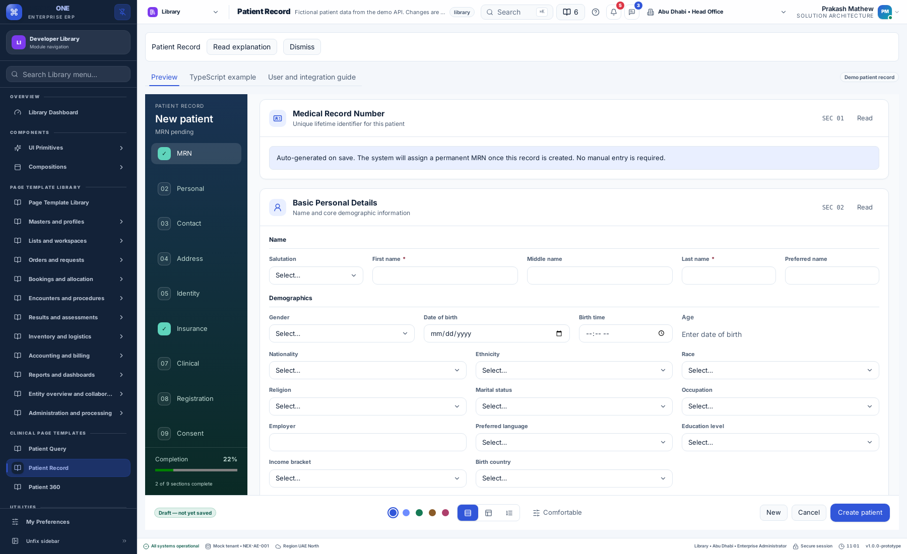

# Patient Record: Allyvora layout alignment

9 September 2026

The Library Patient Record now follows the current Allyvora patient-management
source composition instead of the earlier generic two-column template. The page is
`/library/allyvora-patient-record` on the web demo and **Library → Clinical page
templates → Patient Record** on the desktop shell.

## Design and behavior

| Allyvora source pattern | Library implementation |
| --- | --- |
| Dark 203 px section rail | Full-height rail with record identity, nine steps and completion meter |
| Rail scrolls every section | All nine sections remain mounted in the scrolling content column; clicking a step scrolls to it and scrolling updates the active step |
| Tabs and wizard | One section at a time; keyboard navigation, previous/next and one primary save action |
| Numbered cards | Matching section titles, subtitles, icons, section numbers and Read/Reading controls |
| Personal field arrangement | Twelve-column grid for names, demographics, birth time, calculated age and additional names |
| Contact sections | Separate email and telephone collections, compound country-code/phone controls and communication preferences |
| Conditional details | Insurance policies, disability details, deceased fields, refusal and revocation details follow their controlling values |
| MRN and registration | New records show automatic-generation guidance; saved identifiers and registration status display read-only |
| Persistent footer | New/Cancel, mode-specific care actions, save, theme, layout and density controls remain accessible while the form scrolls, including when page notices appear above it |
| Repeated details | Numbered row cards, primary toggles, conditional fields and gated Add buttons |
| Document staging | Shared FilePicker stages file name, MIME type and byte count; the demo API saves metadata, as the reference source does |
| Save/review | Review before saving, required fields and server errors, retained edits, retry identity and version conflict handling |

The large Library heading and the right-side summary/history column were removed
from the record preview. Preview, TypeScript and Guide remain in a compact Library
strip. Query and 360 retain their own compositions.

## Components and project rules

- `RecordSectionLayout` is exported from `@pepbits/erp-screens`. It accepts generic
  section definitions and identity, rail, footer and section-renderer slots.
- `PatientRecordSection` supplies the patient-specific cards and API field groups.
- `PatientFieldControl` and `PatientCollectionEditor` use shared input, select,
  toggle, date/time, badge, card, description, button and file-picker components.
- `RecordPreferenceControls` calls the existing preference service. Tenant locks
  disable the affected controls and remain enforced by the existing policy layer.
- CSS is scoped to this layout; it does not restyle existing pages or source Allyvora.
- All schema, field options, patient values and child rows come from the demo API.
  The frontend contains no patient fixtures or direct API URL/token handling.
- Theme, typography, density, language, RTL and reduced-motion preferences remain
  application-owned. The reference's standalone theme presets are represented by
  this project's supported themes, rather than creating a second preference store.

## API and data compatibility

The existing typed `ClinicalTemplateAdapter` remains the integration boundary.
Schema version 2 adds presentation groups, column spans, conditional fields and
repeat-add requirements. Previously saved demo records receive defaults for newly
introduced optional fields when loaded; existing values and versions are retained.

The API owns MRN, UHID, branch MRN and registration status. It projects primary
contact changes into search email/phone values. Removing an email clears the search
value and does not recreate that contact on a later load. The tests cover those
behaviors. Existing free-text demographic values remain valid when presented through
new select controls.

Actual insurer checks, binary document storage, tenant DCP services and production
clinical workflows are not connected. The demo insurance check remains explicitly
identified as a policy-expiry calculation. No real patient data is copied from Allyvora.

## Comparison reference and limits

Reference files were read from:

- `allyvora-platform/frontend/provider-web/apps/portal/src/app/t/patient-management.tsx`
- `.../section-layout.tsx`
- `.../pr-patient.css`

The supplied development endpoint uses a self-signed certificate and redirects
unauthenticated requests to its login page. No authenticated reference session was
available. Comparison therefore uses the local implementation and its stylesheet. This records
source-based layout alignment, not a pixel-diff certification against an authenticated
live tenant. The outer application shell, supported preference themes and demo service
responses remain those of this project. Native translation review remains pending.

## Verification

The targeted component suite covers retained edits, retry safety, read-only behavior,
scope isolation, late-response isolation, new-record reset and calendar-age edge cases.
Empty contact editors remain local until edited, and typing retains input focus; a
regression test checks that untouched editors do not create saved rows.
API tests cover saved identifiers and contact projection in addition to existing
registration, scope, validation, concurrency, booking and eligibility checks.

The browser suite verifies nine mounted rail sections, automatic MRN presentation,
initial completion, footer visibility, layout switching, registration with a failed-save
retry, care overview, booking, export and four-language/RTL behavior.

Local full CI passed: 1,469 tests across 98 files, 61 existing API tests, seven
clinical API tests, both builds and all project checks. The final browser run also
passed after the footer/wizard refinements, including record accessibility, keyboard
navigation and translated record fields. The final contact refinement also passed nine targeted tests, clinical API tests,
package typechecks, production builds, project checks and the clinical browser suite.

## Released and verified

- Runtime commit: `2b3095f9bd4eba9709927bf6bf24185717a93276`.
- [Final CI run](https://github.com/IAMPrakashJM/enterprise-fronend/actions/runs/34342533619):
  all six jobs passed, including 1,470 tests in 98 files, API checks, browser workflows,
  product integration, navigation and native Linux lifecycle/localization.
- Release: `20260909105221034-acc45bbc`, activated on both public demos on 9 September 2026.
- Live browser checks passed on `front-design.pepbits.com` and
  `desktop.front-design.pepbits.com`: API-backed metadata/new record, 203 px rail,
  nine sections, completion meter, source field groups, footer, tabs and wizard.
  The footer remained inside the viewport with the documentation alert displayed.
  No runtime errors or patient create/update/export requests occurred in these live checks.
- A regression test inserts an extra page notice and verifies footer visibility.
  The clinical browser suite also passed locally after that adjustment.
- Previous frontend releases and the API/data backup are retained for rollback.

The screenshot above is from the deployed web page. The authenticated-reference
comparison and native-speaker review limits described above still apply.
