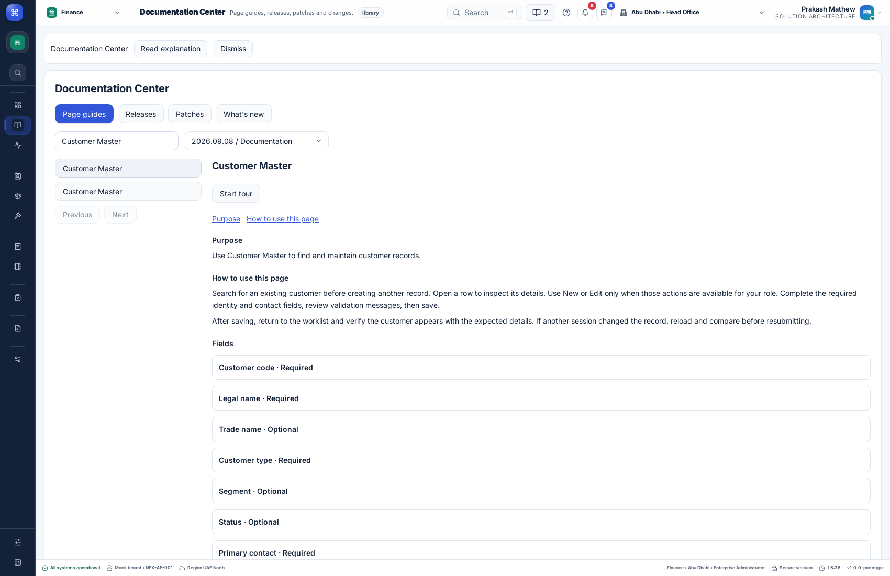
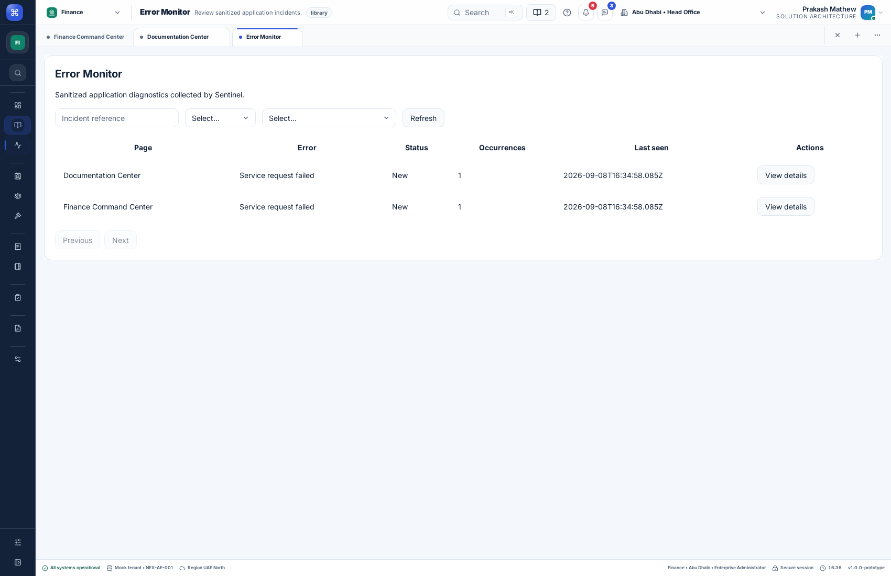
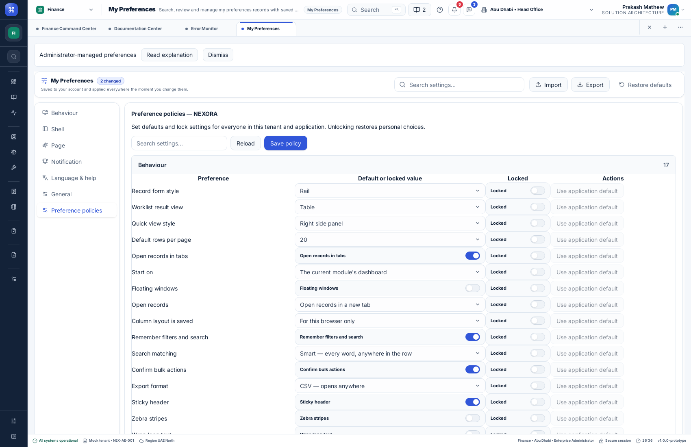

# Sentinel and documentation deployment — 8 September 2026

Application commit `0863354` is deployed as release `20260908162629872-aaba59f3` on both [web](https://front-design.pepbits.com) and [desktop browser](https://desktop.front-design.pepbits.com) demo sites. The API is still the local demo service. No external monitoring provider was introduced.

## What users can use

- Preferences → Preference policies: administrators can search 53 settings organized into six groups and manage tenant/application defaults and locks.
- Header book button → Documentation Center: page guides, version history, patch history and change explanations follow the effective language preference.
- Page picker → Error Monitor: administrators can review sanitized incidents, filter them, look up a reference and update their investigation status. Ordinary users cannot read the incident API.

See the [Sentinel integration guide](sentinel-monitoring.md), [documentation integration guide](documentation-center-integration.md) and [preference policy guide](tenant-preference-policies.md) for contracts, configuration and application integration.

## How error recovery works

1. A supported runtime, render, request, operation or native failure produces an allowlisted diagnostic. Exception messages, request bodies, tokens and raw stacks are excluded.
2. The authenticated shell queues diagnostics in memory and submits them to the demo monitoring API.
3. Failed or timed-out uploads retry with the same event IDs and increasing delays. The API recognizes duplicate deliveries. Business operations are never retried by Sentinel.
4. The tenant/product-scoped administrator inbox shows incidents and status history.
5. A native Rust panic writes a fixed local marker. After restart and sign-in, the native shell reports it and clears the marker only after successful delivery.

Browser queues do not survive reload or process termination. Native panic recovery does not capture every OS crash or reconstruct the previous user's identity/page. Only diagnostic uploads have automatic retries.

## Verified results

All six jobs in [remote CI run 34251090970](https://github.com/IAMPrakashJM/enterprise-fronend/actions/runs/34251090970) passed:

| Check | Result |
| --- | --- |
| Unit tests | 1,405 passed across 85 files |
| Demo API tests | 48 passed |
| Registered end-to-end suites | 31 passed: 9 browser, 17 feature, 1 navigation, 1 product, 3 native |
| Type checks, production builds, deployment lifecycle and repository verification | Passed |
| Native lifecycle and language rendering | Linux/WebKitGTK: passed for Arabic, Hindi and Malayalam |
| Native panic recovery | Actual debug-process panic and exit; restart; authenticated upload; sanitized incident; marker acknowledgement |
| Browser delivery recovery | Disconnected request, repeated server failure, upload timeout, stable IDs on retry, monitoring-only 401 without logout |

Native fault injection uses the one-use `NEXORA_SENTINEL_TEST_PANIC_ONCE` file trigger and is absent from release builds. Tests used isolated demo data and application directories. No deliberate live crash was induced.

After activation, both public sites passed health, HTML/assets, authentication, navigation and Arabic catalog checks. Browser checks verified the documentation article, Error Monitor, all 53 settings/six groups, and zero runtime errors. API checks verified all four guide languages, administrator access and ordinary-user denial.

The initial overlapping public probes encountered an HTML login error and a documentation search timeout. Sentinel recorded two request diagnostics with HTTP 429. Fresh sequential verification passed on both sites. These observed incidents remain in the demo inbox; they were not deleted or marked resolved to hide the initial failures.

## Screenshots from the live sites

### Documentation Center

### Error Monitor

### Grouped preference policies

## Deployment and rollback

The release was built and checked in isolation before activation. The API data was copied while the API was stopped, then the API restarted and both frontend shells activated. The previous frontend release `20260908132518280-e399b58e` remains available. Previous API source and a stopped-service data snapshot are retained under `.deploy/api-backups/20260908162629872-aaba59f3/` on the deployment host. Restore matching API code/data and frontend assets together if rollback is required.

The public desktop site is the browser shell. Linux native execution was verified locally and in CI; this deployment does not publish a new native installer.

## Still pending

- Qualified native-speaker review of Arabic, Hindi and Malayalam wording, plus healthcare-domain review. Automated rendering and catalog coverage do not establish linguistic approval.
- Detailed task documentation for 175 reference-only pages; four workflows are currently authored out of 179 page references.
- Windows/macOS native runtime and installer validation, and broader crash testing across desktop browsers.
- Production monitoring integration, external alert delivery, OS crash dumps/source maps, server-process crash collection, durable browser queues and production retention/operations policies.
- The additional authoring, publication, rollout and offline capabilities listed in the documentation integration guide.
