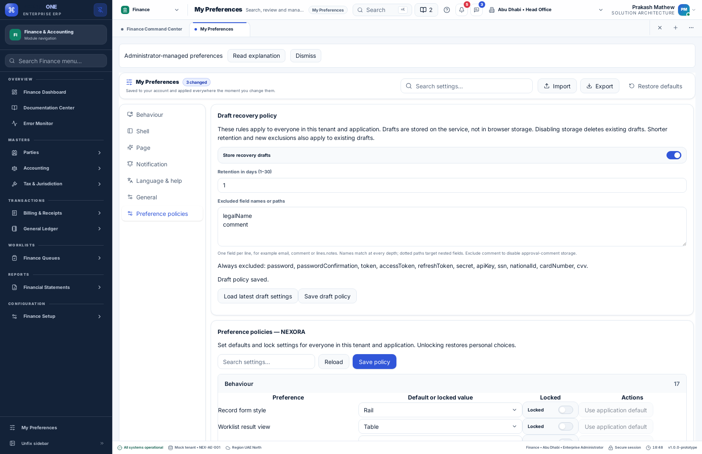
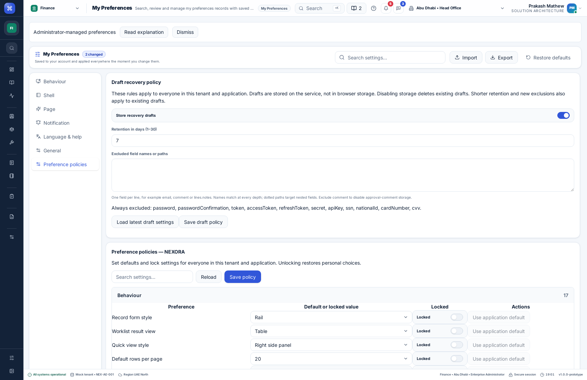

# Shared draft recovery: user and integration guide

Forms, CSV column mappings and approval comments now share the demo API's durable, versioned draft store. An acknowledged draft survives a page reload, browser closure or application restart. Drafts belong to the signed-in tenant, application, user and record or workflow. Saving a draft does not save a business record, import a row or approve anything.

## Using a draft

1. Edit a form, map CSV columns or type an approval comment. After an 800 ms pause, the frontend sends a draft to the service.
2. Wait for the saved status and its last-saved time. Only acknowledged values are recoverable; a crash before acknowledgement can lose the newest edits.
3. Reopen the same application and record with the same account. The page offers **Restore draft** and **Discard draft**, with the saved time. It does not restore automatically.
4. Restore to continue editing. Discard removes the recovery snapshot. Normal validation and confirmation still apply before saving or submitting.

Draft values are not stored in localStorage, IndexedDB or sessionStorage. A disconnected browser keeps edits in memory and offers recovery actions, but cannot create a durable service draft until connectivity returns. Browser closure while offline can lose unacknowledged work.

## Workflow details

| Workflow | What the service stores | What happens after reopening |
| --- | --- | --- |
| Forms, billing and consultation editors using `useRecordEditor` | Allowed form values, base record version, draft version and saved time | Restore or discard; changed records require the existing compare/review flow before saving |
| CSV imports | Field-to-column indices and a SHA-256 hash of the column headers | Reselect the CSV; Restore is available only for matching headers. Rows and filenames are not part of the mapping draft. Validate the reselected rows before confirming |
| Record approvals | Comment text and a hash of the approval/configuration versions | Restore the comment after reviewing any changed source; submit or decide explicitly |
| Approval inbox | One comment draft per page inbox and user | Restore the bulk comment, then select the intended records again. Selections and approval actions are not replayed |

The import service's existing confirmed jobs and row results remain separate. Restoring a mapping does not rerun a previous import. Approval drafts do not persist pending mutation operation IDs; after an uncertain action and a restart, refresh and inspect the current history before deciding again.

Successful form saves and explicit form discard/close clear the corresponding recovery snapshot. Import confirmation clears the mapping draft. Successful approval submission/decisions clear the comment; partial failures retain it. Explicitly clearing the comment also discards its draft. Discard and completion remove old draft replay payloads, while keeping version tombstones to block late writes.

## Outdated drafts and conflicts

A form draft records the business version it was based on. If another user saved the record, restoration keeps the local draft but blocks the next save until the user loads and reviews the current saved version. Keeping edits is an explicit choice, and the API still checks versions on the subsequent save.

Excluded draft fields are filled from the current saved record or the editor defaults, then ordinary field validation runs. The UI explains that protected fields were omitted. Incompatible draft schemas remain discardable; they are not silently applied.

Imports require the original header sequence before offering restoration. The user may choose a different file with matching headers, but must validate its rows afresh. Approval comments with a changed context require an explicit acknowledgement that the current source was reviewed. Approval decisions continue to use current item versions and the server's eligibility checks.

Two windows cannot overwrite the same draft silently. Every write/discard includes the last acknowledged draft revision. A 409 offers a load-latest action and an explicit restore/discard choice. Unknown transport outcomes retain the same payload and operation ID for an explicit retry.

## Tenant administrator controls

Open **My Preferences → Preference policies → Draft recovery policy**.

- **Store recovery drafts:** on by default. Turning it off removes all existing drafts for this tenant/application and prevents further draft persistence. Business record saves remain available.
- **Retention:** 1–30 whole days from the last successful draft save; the default is 7 days. Reads, startup and an hourly job purge expired snapshots and their draft replay payloads.
- **Excluded fields:** up to 100 names or dotted paths. A name such as `email` matches at every depth; `lines.notes` matches that nested field in every array item. Matching is case-insensitive. Add `comment` to prevent storage of approval-comment text.
- Passwords, tokens, API keys, national identifiers and payment-secret field names listed in the panel are always excluded. Administrators cannot unlock those defaults.

Rules apply to every user and cannot be overridden through personal preferences. Saving a stricter policy scrubs existing snapshots and replay copies before acknowledging the change. Policy revisions reject concurrent administrator changes. Reopen a page to load updated policy information; the API applies the latest policy to every request immediately.

Exclusions operate on field names and paths, not on the meaning of free text. Product owners must configure all sensitive fields in their schemas, including clinical notes where appropriate. Disabling storage deletes recovery drafts, not saved business records, import jobs or approval history. Operational backups are governed by their separate retention policy.

## Architecture and API contract

`erp-config/src/draft-policy.ts` defines the shared policy, validation, recursive exclusions and partial-value restoration. `erp-data/src/drafts.ts` exposes `DraftAdapter`, HTTP transport and hashed context generation. `erp-screens/src/drafts/use-shared-draft.tsx` handles loading, debounced writes, retries, revision tracking and restore/discard presentation. Forms retain `RecordEditor` and its business-version conflict handling.

The demo API stores draft snapshots alongside versioned record data in `records.json`, using atomic file replacement and restrictive file permissions. Forms and shared import/approval drafts use the same `createRecordStore` engine. Generic workflows have reserved `$draft:` keys that cannot be accessed through the ordinary record routes. Tenant draft policies are stored in `draft-policy.sqlite`; policy updates are audited without draft values. The default demo is a single-process service, not a multi-host transactional database.

| Route | Contract |
| --- | --- |
| `GET /draft-policy` | Current mandatory policy and whether the requester may administer it |
| `PUT /draft-policy` | Administrator-only revision-checked `{revision, enabled, retentionDays, excludedFields}` |
| `POST /drafts` | `{kind, pageId, recordId, action}`; kind is `import` or `approval`; action is `load`, `draft` or `discard` |
| Existing `/records/{key}` routes | Form bundle, versioned business save, draft and discard; key is a JSON pair `[applicationId, logicalRecordKey]` |

Send a bearer token and `X-Product-Id` for shared draft/policy requests. The API derives tenant and owner from the authenticated session and checks application/page access. It never accepts an owner or tenant override from the payload. Record routes validate application access too; create destinations must remain in the same application and logical record type.

A shared draft write adds `version`, a stable UUID `operationId`, and `values: {schemaVersion: 1, context: "<64-character SHA-256 hex>", data}`. Approval data permits only `comment`; import data permits only `mapping`. The API rejects CSV contents or extra arbitrary fields. A discard supplies the current version and a fresh operation ID. Revision tombstones remain after deletion and expiry.

## Integrating another SaaS application

Use the standard authenticated `ProductServices.request`, or inject `ProductServices.drafts` with a `DraftAdapter`. Existing custom record adapters continue implementing `RecordAdapter`; include optional `draftPolicy`, `excludedFields`, `schemaVersion` and `disabled` metadata to expose equivalent policy behavior.

Custom services must enforce authenticated tenant/user scope, application/record authorization, mandatory exclusions, retention, revision checks and idempotency on their backend. Frontend controls alone do not enforce the policy. Honor AbortSignal through custom HTTP transports and keep failures typed with status and an optional incident reference. Return a successful save only after storage acknowledges it.

Keep logical record IDs stable across reloads. Use one stable workflow ID for a new-record editor or import mapping; use the saved record's ID for edits. Increase the payload schema version when a format becomes incompatible. Hash only the source identity/version information needed to recognize a stale draft; do not put raw record values, headers or histories in the context field.

For a production multi-host API, use transactional storage for business records, draft revisions, expiry and idempotency, and include drafts in the application's backup and access-control design. The demo does not add local offline draft storage or guarantee that an unacknowledged change survives a crash.

## Verification

Tests cover policy authorization and scope, recursive mandatory exclusions, retroactive scrubbing, retention, restart persistence, concurrent revisions, disabled storage, safe partial restoration, incompatible schemas, same-operation retries and completion racing an in-flight draft save.

`e2e/drafts.mjs` verifies actual reload recovery in forms, imports and approvals; explicit discard; absence of draft values in browser storage; and the administrator controls. It runs with an isolated API data directory. Catalogs and recovery controls support English, Arabic, Hindi and Malayalam. New wording is marked Pending in `docs/localization-review/drafts-*-review.csv` for native-speaker review.

## Verified release — 8 September 2026

Code commit `1df8ee95e5646aa062a034f5133b054194e8ed65` passed all six jobs in [GitHub Actions run 34265737466](https://github.com/IAMPrakashJM/enterprise-fronend/actions/runs/34265737466): 1,440 unit tests in 90 files, 55 API tests and 33 runtime suites (9 browser, 19 feature, 1 navigation, 1 product and 3 native Linux). Type checks, production builds, localization and repository verification also passed.

Release `20260908185346517-40b515a2` is active on both [web demo](https://front-design.pepbits.com) and [desktop browser demo](https://desktop.front-design.pepbits.com). Public browser checks verified the administrator draft controls, authenticated draft reads, all four language catalogs and zero runtime errors. Separate probes confirmed HTTP success for HTML, API health, login, navigation and localization. Live checks made no policy or business-record changes; mutation and reload-recovery tests ran against isolated fixtures.

The previous frontend release is retained at `.deploy/releases/20260908174722609-72db4f3d`. API source and pre-deployment data backups are retained locally under `.deploy/api-backups/20260908185346517-40b515a2/`. Backup contents are not committed. Native Linux runtime checks passed; this deployment did not publish a new native installer. Native-speaker review of new wording remains pending.
