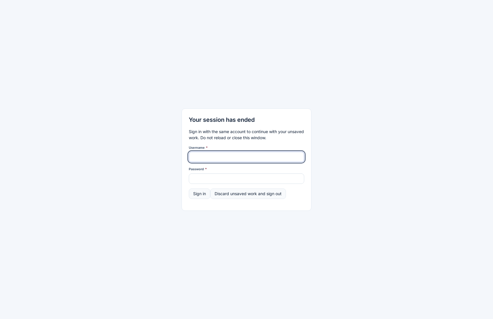

# User error recovery and application integration

The shared frontend now gives users localized explanations and recovery actions for failed requests. English, Arabic, Hindi and Malayalam follow the effective language preference. This implementation uses the existing demo API and Sentinel collector.

For acknowledged drafts that survive reopening, see [shared draft recovery](shared-draft-recovery.md). It adds tenant-controlled service persistence for forms, import mappings and approval comments. Unacknowledged edits still depend on the open window.

## What users see

| Failure | Explanation and action |
| --- | --- |
| Connection unavailable | Keep the page open. The outcome may be unknown. Retry the same pending operation rather than starting another one. |
| Request timeout | The request exceeded its deadline. Retry uses the workflow's existing operation identity where supported. |
| Access denied (403) | The current role cannot perform the action. No mutation retry is offered in the shared notice. |
| Invalid input (400, 413, 422) | Correct the values. Record field errors stay attached to the fields. |
| Session expired (401) | A blocking sign-in dialog keeps the workspace mounted. Sign in with the same account to continue. |
| Too many requests (429) | Wait before retrying the same action. |
| Service unavailable (5xx) | Retry without discarding the values already entered. |
| File generation failed | Check browser downloads and explicitly retry if the file is missing. |
| Export audit failed | The file was generated. Retry records the audit without generating another download. |

The shared notice displays an incident reference when the transport supplied one. It does not invent an untraceable reference for a custom adapter's error. Raw exception messages, server bodies, paths and stacks are not shown by this notice.

Reload is offered for record recovery only when there are no dirty edits. Return to page is supplied by the owning screen, for example to close the import dialog or return from an unavailable table. Neither action automatically retries a business write.

## Form and session flow

1. Editing changes the document's in-memory values. The existing service draft mechanism continues to run when the session and service are available.
2. A failed save retains those values, the last acknowledged baseline and the pending operation ID. No failed response is treated as a successful save.
3. Validation failures keep the field errors and permit correction. Version conflicts retain the existing compare-and-review workflow.
4. An expired session removes the unusable bearer token and locks the workspace behind a native HTML modal dialog. Background portals are inert while the dialog is open.
5. A successful sign-in must match the retained account, tenant, role and branch. The user explicitly retries a pending operation after sign-in; the app does not silently replay it.
6. A different account cannot unlock that workspace. The user can explicitly sign out after confirming that in-memory work may be lost.
7. Other windows sharing browser storage lock on session expiry and validate a replacement token before unlocking the same identity. Explicit logout still clears their session.

Only the session token and a non-sensitive expiry marker are stored in browser storage by this flow. Form values, CSV contents, comments and passwords are not copied there. Reloading, closing the process or an OS crash can still lose values that the service has not acknowledged as a recovery draft.

## Imports, approvals, tables and exports

CSV contents, manual mappings, validation previews and import jobs remain in place after failed requests. Preview retries use the same preview ID. Processing retries use the existing job; completed rows are retained. Required-field and duplicate errors remain reviewable before confirmation.

Approval comments and edited stage names remain in memory after failures. Unknown, timed-out and rate-limited mutations keep their pending operation ID. A retry cannot silently become a different approval decision. Definitive validation rejection allows the user to correct and resubmit. Successful confirmation clears the submitted comment as before.

Table filters and search values remain visible when a request fails. An access refusal is not presented as an empty result. Inline version conflicts still require comparison rather than an automatic overwrite.

CSV and Excel worklist downloads retain their existing column classification and confirmation controls. Local file-generation failures have a recovery notice. Export audit failures are separate: retrying them does not regenerate the file. Audit transport retries may produce duplicate audit entries if an integrating API does not implement deduplication; the existing demo export-audit contract does not promise exactly-once audit ingestion.

## Technical architecture

- `auth/src/recovery.ts`: typed transport failures, a 30-second request deadline, caller cancellation propagation and safe Sentinel reference headers. The deadline includes reading JSON response bodies. Streaming responses retain their streaming contract. Monitoring delivery retains its separate timeout and loop prevention.
- `auth/src/session.tsx`: session locking, same-identity sign-in, stale-response protection and cross-window renewal. No business request is automatically retried.
- `erp-shell/src/session-lock.tsx`: localized modal sign-in over the retained workspace, including keyboard and background interaction blocking.
- `ops-ui/src/recovery-notice.tsx`: shared classification-to-message rendering and owner-supplied actions. Raw adapter messages are not used as recovery copy.
- `erp-data/src/records.ts`: retained form values, validation fields, pending operations and typed HTTP failure metadata.
- Import and approval adapters carry HTTP status and the Sentinel reference through to their screens.
- `erp-screens/src/worklist/worklist-page.tsx`: table recovery and separate download/audit recovery.
- `products/provider.tsx`: retains loaded application configuration during same-identity renewal; a different identity rebuilds the application context.

## Integrating another application

Use `authedFetch`, or provide a `ProductServices.request` implementation using the same authenticated request contract. Product request adapters receive an AbortSignal and must honor it to support cancellation and the timeout. The shared request wrapper adds recovery metadata for custom transports.

Domain adapters supplied through `ProductServices.records`, `imports` or `approvals` should throw errors with a numeric `status` and an optional safe `reference`. Preserve structured record field errors using `RecordRejected`. Do not use exception text to choose the recovery category.

Custom domain adapters that own authentication must call `expireCurrentSession(tokenUsedForTheRequest)` on a verified 401. Passing the token used for that request prevents a stale response from expiring a newer session. A normal product HTTP request performs this automatically.

Keep the same operation ID when retrying an uncertain mutation. The integrating API must enforce its idempotency contract and tenant/product/user permissions. Do not automatically retry a non-idempotent business write.

Render `RecoveryNotice` with the failed operation's retry callback, a suitable return action and `preservesValues` when edits are retained. Only set `sessionRestored` after the application's authenticated session is usable again. The component suppresses Reload when values must be preserved.

## Localization and verification

Recovery messages are canonical in `dummy-api/config/localization/shared/{en,ar,hi,ml}.json` under `recovery.*`. Run `npm run localization:sync` from `desktop-clients` after editing the catalogs. Translation review CSV files contain the new copy marked Pending; native-speaker approval has not been claimed.

Tests cover classification/actions in all four languages, transport and JSON-body timeouts, cancellation, reference correlation, same-user and cross-window session renewal, retained record edits and validation errors, retained import jobs and mappings, approval comments and operation IDs, table permission failures, and export retry without a second download. The dedicated browser suite is `e2e/recovery.mjs`; native modal recovery is part of `e2e/native-sentinel.mjs`.

The changes extend the existing shared workflows. They do not provide durable offline storage, OS crash recovery for unsaved browser values, production authentication or exactly-once semantics for arbitrary third-party APIs.

## Verified deployment — 8 September 2026

Code commit `eb93a1dff4f2ef86d912344d90e1acfca5a20c4a` passed all six jobs in [GitHub Actions run 34259172734](https://github.com/IAMPrakashJM/enterprise-fronend/actions/runs/34259172734):

- 1,432 unit tests in 88 files and 48 API tests.
- 32 runtime suites: 9 browser, 18 feature, 1 navigation, 1 product and 3 native Linux suites.
- Type checks, localization verification, production builds and repository verification checks.

The earlier native CI attempt exposed unreliable controlled-panic startup. The test now waits for application readiness, isolates the WebKit profile and retains process diagnostics. Three consecutive local recovery runs and the final native CI job passed. Native checks include Arabic, Hindi and Malayalam billing screens, a real controlled panic/restart and same-user session recovery. This validates the Linux native runtime; a new installer was not published in this deployment.

Release `20260908174722609-72db4f3d` is active on both [web demo](https://front-design.pepbits.com) and [desktop browser demo](https://desktop.front-design.pepbits.com). Both packaged shells passed HTML/asset checks before activation. The demo API restarted to load the updated message catalogs.

Live browser checks on each site verified readable failed-sign-in copy, session locking, same-user sign-in with the original page still mounted, retained search text and explicit Retry. English, Arabic, Hindi and Malayalam recovery catalogs returned successfully, with no browser runtime errors. These checks intercepted only a read-only search in the test browser; they did not edit business records or tenant policies. Separate public probes confirmed successful HTML, API health, login, navigation and Arabic catalog responses.

The previous frontend release is retained at `.deploy/releases/20260908162629872-aaba59f3`. Pre-deployment API source and data are retained under `.deploy/api-backups/20260908174722609-72db4f3d/`; these local rollback files are not committed. Native-speaker review of the new translations remains Pending in the review CSV files.
