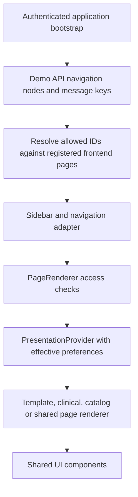
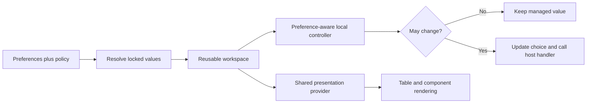

# Library architecture and preference flows

Current architecture review: 11 September 2026. Delivery and verification status are recorded separately in the [current delivery index](../releases/unreleased/README.md).

## Package responsibilities

| Layer | Location | Responsibility |
| --- | --- | --- |
| Application shells | `desktop-clients/apps/web`, `apps/desktop` | Browser routes or desktop navigation, session/provider composition and rendering |
| Configuration | `packages/erp-config` | Page definitions, template definitions, Library route manifest, preference types/defaults and policy resolution |
| Application state | `packages/erp-shell` | Effective preferences, central updates, application context, theme/font/language tokens and policy refresh |
| Data adapters | `packages/erp-data` | Typed API boundary; clinical requests, structured responses and failures |
| Reusable screens | `packages/erp-screens` | Template engines, clinical workspaces, catalog examples, dedicated reference pages and record interactions |
| UI primitives | `packages/ops-ui` | Controls, cards, tables, overlays, localization helpers and the generic presentation context |
| Style tokens | `packages/tokens` | Semantic colors, fonts, radius and managed-table CSS |
| Demo backend | `dummy-api` | Authenticated demo configuration/data contracts, preference storage and policy enforcement |

Paths under `packages/` are relative to `desktop-clients/`. ops-ui does not import ERP or API clients. Consumers compose shared primitives and supply application behavior.

## Navigation flow



The backend chooses which registered menu items are available. It does not send executable React components. An unknown page ID cannot become an arbitrary frontend component. `LIBRARY_PAGE_IDS` is derived from Library navigation and includes shared destinations such as Preferences; the canonical module assigned to a shared page must not accidentally exclude it from Library presentation rules.

The current inventory has **158 Library destinations**, including shared routes, component examples, template demonstrations and API-backed workspaces. Page Library contains List of pages and 13 working page destinations. This is a navigation inventory, not a claim that 158 production workflows have passed domain acceptance. See the [machine-readable inventory](../testing/v1.0.0/inventory.json) and [Page Library catalog](../features/page-library-catalog.md).

## Preference resolution

The order is application defaults, tenant/application defaults, personal choices, then locked policy values. A lock has the highest priority.

```mermaid
sequenceDiagram
    participant User
    participant Screen
    participant ERP as ERP provider
    participant API as Preference API
    User->>Screen: Open page or change setting
    ERP->>API: Read preferences and policy for authenticated scope
    API-->>ERP: Preferences, policy, revisions and capabilities
    ERP->>ERP: Validate and resolve effective values
    ERP-->>Screen: Values, locks, availability and update handler
    alt Setting locked or preferences unavailable
        Screen-->>User: Disabled control; preserve effective value
    else Setting editable
        Screen->>ERP: Request preference change
        ERP->>API: Persist allowed personal overrides
        API-->>ERP: Authoritative snapshot or failure
        ERP-->>Screen: Resolved state or localized recovery
    end
```

The API derives user/tenant authority from authentication and uses the selected application context. The UI's `scope`, `scopeKey`, disabled controls and TypeScript types do not grant permission. The existing backend policy guide describes the exact request/response contract and SQLite storage.

The response property is `policy`, not `preferencePolicy`. `preferencePolicy` is the React host property's name after parsing. Keep this distinction in integration tests and API adapters.

Stored personal preferences and temporary local demo choices are different. An existing persisted preference can return when an administrator unlocks a setting. A local `usePreferenceChoice` override is reset when the source/lock changes; it must not reappear as a hidden override after unlocking.

## Table and typography flow

`PresentationProvider` supplies density, stripe, sticky-header, wrapping and page-size values without depending on ERP. Table consumes the applicable presentation values; DataTable also uses them when formatting its cells. Page size remains a controller concern: changing the provider value alone does not fetch or paginate rows.

Managed table CSS overrides fixed cell padding in consumer classes. Compact, comfortable and spacious rows use distinct padding. Long text can wrap; status badges remain on one line. Selection appearance takes precedence over alternating stripes.

The ERP provider applies the font family, root language/direction and theme tokens. Form regions bind `--fs-scale` to `--fs-form`; result regions bind it to `--fs-result`. Changing result text size therefore does not force the form text to the same size. Clinical rectangular surfaces and Library controls consume the radius token. Semantic shapes such as avatar circles are not an alternate card-radius control.

## Reusable workspace flow

`PageTemplateWorkspace` and `ClinicalPatientWorkspace` accept `PreferenceHost` properties. They resolve policy values before rendering their children. The application may pass `onPreferenceChange` to persist changes through ERP; a standalone demonstration can omit the callback and retain an unlocked local choice.



These workspaces remain reusable across patient, employee, customer, order and other applications. Configuration provides fields/sections/columns; the adapter provides data and operations. Domain validation, authentication, clinical/business acceptance and backend transaction guarantees remain application responsibilities.

## Query and recovery flow

Worklist Query (`allyvora-patient-query`, formerly Patient Query) collects criteria, calls the demo adapter, renders results and offers pagination, table/cards, previews and exports. Result view and preview placement come from My Preferences; the result toolbar does not duplicate those selectors. Inline, centered card/modal and left/right drawer are effective preference values, including when enforced by a tenant lock. Page-size changes update the search controller and reset the requested page. Export uses the selected CSV/Excel preference. Custom shortcut listeners are not attached when shortcuts are disabled.

A failed request is not treated as a successful operation. Structured failures feed localized recovery controls; query criteria and in-memory record edits survive the supported recoverable flows. In-memory retention is not durable draft storage. Applications requiring durable clinical drafts must connect the existing scoped draft service and its sensitive-field policy.

## API-backed page families

| Family | Adapter / endpoint | Data ownership |
| --- | --- | --- |
| Worklist Query, Master Record – Main, 360 Data | `createClinicalTemplateAdapter` / `/clinical-templates` | Shared synthetic patient and related records in CSV; see the [storage guide](../features/page-templates-csv.md) |
| Billing Clinic | `createClinicBillingAdapter` / `/clinic-billing` | Separate billing ledger, with patient references; see [billing integration](../features/billing-clinic.md) |
| Triage and consultations | Typed clinical adapters / `/clinical-triage`, `/clinical-consultation`, `/comprehensive-consultation` | Persisted assessment/note stores; OP Consultation reuses consultation storage and reads triage context. See [clinical composition](../features/clinical-workspace-update.md) |
| OP Registration | `createRegistrationAdapter` / `/op-registration` | Encounter, draft and service lifecycle alongside the shared clinical patient adapter; see [registration](../features/op-registration.md) |
| Emergency, inpatient and consultation reference pages | `createCareAdapter` / `/care-pages` | Isolated synthetic record store; bed reservations shared by tenant/application. See [care templates](../features/care-page-templates.md) |
| Labels, printing and devices | `/label-printing`, `/device-integrations`, `/identity-devices` | API-owned jobs/policies and injected transports. See [printing](../features/barcode-qr-printing.md), [devices](../features/device-integrations.md) and [identity readers](../features/identity-devices.md) |

These stores are not automatically one production patient, finance or device service. A matching screen design or shared component does not synchronize separate domain stores. Integrating applications must supply trusted identity mapping, domain authorization and transaction boundaries. The generic Page Template Library TEMP continues to use explicitly labelled in-memory demonstration adapters; the API-backed Page Library is a distinct family.

## Extension boundaries

Add new shared UI behavior to primitives or a reusable controller, not separately to every Library route. Add new metadata-driven pages through registered definitions and supported adapters. Extend both API catalogs and offline localization fallbacks. Change the Library inventory and versioned testing contract when a new route or behavior changes acceptance scope.

See [development rules](../development/RULES.md), [integration instructions](../features/library-preferences.md) and [verification limits](../releases/unreleased/verification-2026-09-09.md).
