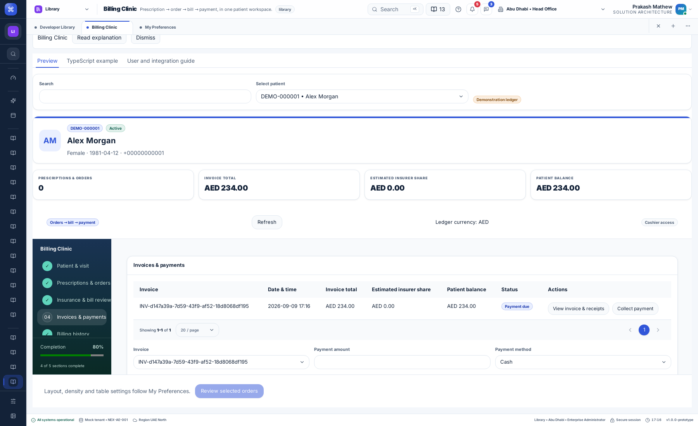

# Billing Clinic — user and integration guide

Feature ID: `CLINIC`. State: implemented; validation and publication status are recorded in the [delivery evidence](../releases/unreleased/billing-clinic-2026-09-09.md). Location: **Library → Page templates → Billing Clinic** (`billing-clinic`).

## User problem and outcome

A cashier needs patient information, doctor and visit context, prescriptions, ready orders, insurance estimates, invoices and payment history together. Billing Clinic supplies a reusable desktop workspace with an API-backed ledger. It extends the confirmed patient template family and leaves the existing generic billing templates available.

## User and administrator flows

1. Search by patient information and select a patient. The summary shows identity and contact details. **Patient & visit** shows the available encounter, care-team, clinical and appointment entries from the same demo patient API.
2. In **Prescriptions & orders**, select prescribed items and choose **Convert selected prescriptions**. Confirm the action. Already billed items cannot be selected again.
3. Add a service from the API catalog, with a whole-number quantity and ordering doctor. New source prescriptions/orders are picked up when the ledger is loaded again. Source descriptions and IDs remain visible.
4. Select ready orders and choose **Review selected orders**. Review item quantities, prices, discount, tax, insurer estimate and patient share. Choose self pay or an existing patient insurance policy. Insurance requires a demo authorization reference; expired policies are rejected.
5. Confirm the invoice. The API calculates and snapshots its lines and totals. The same orders cannot be invoiced again. Issued invoices are immutable.
6. In **Invoices & payments**, select an invoice, enter a payment amount and method, and confirm. Partial payments are supported. Card/transfer entries require a reference; no actual charge or transfer occurs. Overpayment is rejected.
7. Open **View invoice & receipts** to inspect all invoice lines, receipts, refunds and the remaining patient balance. Export the invoice lines in the format selected in My Preferences (CSV/Excel), or use **Save as PDF** to open the browser's print dialog. Confirm the disclosure notice first. Print output includes all rows, independent of table pagination. An export request is recorded in history; it does not establish that a download or print completed.
8. To reverse one full payment, enter a reason and select **Refund payment**. The original entry stays intact and a negative receipt is appended. A payment can be refunded once. An invoice with no payment history can be cancelled with a reason; its orders return to ready-to-bill status. Invoices with payments, including refunded payments, cannot be cancelled by this demo flow.
9. **Billing history** records action, timestamp, authenticated actor and references. Switch patients only after confirming that unsaved input can be discarded.

Enterprise-admin demo accounts can change the ledger and export invoices. Other authorized accounts can read it. Server-side navigation, tenant/application membership, write permissions and record versions are checked independently of disabled buttons.

Settings remain in **My Preferences**. Tenant-locked effective values control the form layout (rail, tabs, wizard), theme, radius, fonts, density, table stripes, wrapping, sticky headers, page size, formatting and export format. There is no second settings store. Table page size is shown as managed; change it in Preferences. Normal keyboard access remains available without custom shortcuts. Shared layouts follow reduced-motion preferences.



## Technical contract and integration

- `BillingClinicWorkspace` is exported by `@pepbits/erp-screens`. It accepts `PreferenceHost`, an explicit `scopeKey`, a `ClinicBillingAdapter` and a `ClinicalTemplateAdapter` for patient search.
- `ClinicBillingView`, commands, ledger entities and integer-money calculation helpers live in `@pepbits/erp-config`.
- `createClinicBillingAdapter(request, productId)` lives in `@pepbits/erp-data`. The host request function owns authentication and structured error handling; the workspace does not know tokens or URLs.
- Shared `RecordSectionLayout`, patient banner, cards, form controls, modal, recovery notice, pagination and semantic tables compose the screen. The billing panels are separate reusable components; they contain no transport logic. The Library's **TypeScript example** tab contains a public-import integration example.

```tsx
import React from 'react';
import { BillingClinicWorkspace, type PreferenceHost } from '@pepbits/erp-screens';
import { createClinicBillingAdapter, createClinicalTemplateAdapter } from '@pepbits/erp-data';

export function BillingPage({ request, productId, scopeKey, ...host }: PreferenceHost & {
  request: (path: string, init?: RequestInit) => Promise<Response>;
  productId: string;
  scopeKey: string;
}) {
  const adapter = React.useMemo(() => createClinicBillingAdapter(request, productId), [request, productId]);
  const patients = React.useMemo(() => createClinicalTemplateAdapter(request, productId), [request, productId]);
  return <BillingClinicWorkspace adapter={adapter} patients={patients} scopeKey={scopeKey} {...host} />;
}
```

Use authenticated tenant + application + user identity for `scopeKey`; changing it remounts the workspace. The server derives tenant/user identity from the session, not this UI key. Another healthcare application can replace the adapters while retaining the workspace and preferences. Implement the same permissions, operation receipts, version conflicts and monetary validation in the replacement service.

### Demo API and storage

`POST /clinic-billing`, authenticated, with `X-Product-Id`. Read payload: `{action: 'load', patientId}`. Mutations add `patientId`, `expectedVersion`, and a stable `operationId` to the typed `order`, `add`, `invoice`, `payment`, `refund`, `void` or `export` command. Responses return the authoritative view, including `canWrite`, patient, visit context, service catalog and ledger.

Patient data comes from the existing clinical CSV store. Service pricing comes from `dummy-api/config/clinic-billing/services.csv`: price is integer minor units; tax and coverage are basis points. Demonstration source pharmacy entries map to the medication tariff and source order entries to the laboratory tariff; production must supply explicit service-code/tariff mapping rather than infer clinical intent from these demo categories.

The ledger is `${RECORD_DATA_DIR ?? NEXORA_DATA_DIR ?? dummy-api/data}/clinic-billing.csv`. Columns are `tenant,application,patient,data`. Each quoted data cell contains one structured ledger snapshot and its retry receipts. The API rereads CSV on requests and writes through the shared atomic temporary-file/fsync/rename helper. Corrupt existing storage fails instead of silently replacing saved data. Each patient is isolated within tenant/application scope. Retry receipts additionally identify the authenticated user.

Calculations use integer minor units and basis points: discount applies per line before tax, insurer estimate applies to discounted net, and the patient owes the remainder plus tax. The API recomputes totals; it never trusts submitted client totals. The demo ledger currency is AED. Formatting preferences change presentation, never the ledger currency or monetary value; this is not currency conversion. Billing money retains at least two decimal places, including exports, even when the general number preference is zero decimals. This monetary-precision constraint prevents displayed lines from losing cents; ordinary quantities retain the general number setting. CSV/Excel exports reuse the classified, formula-safe shared exporter.

## Compatibility, localization and accessibility

This is an additive page and separate ledger file. It does not migrate or overwrite patient registration data. Canonical `template.clinic.*` messages are in `dummy-api/config/localization/shared/{en,ar,hi,ml}.json`; generated fallbacks and API error mappings are synchronized. A versioned authored help guide, tour entry and feature alert accompany the new page. Catalog translations are not native-speaker or healthcare-domain acceptance.

Controls have accessible labels, dialogs have confirmation/cancel actions, the sidebar uses the existing keyboard behavior, and tables inherit effective presentation preferences. Wide ledgers scroll inside shared table containers. The print view intentionally prints the whole receipt, rather than only the current interactive table page.

## Acceptance, completed and pending work

Completed implementation: patient/context read, prescription conversion, service orders, invoice review and immutable posting, insurance estimates, partial payments, full-payment refunds, unpaid cancellations, receipts, classified CSV/Excel exports, print/PDF view, durable demo ledger/history, idempotency, permission/version checks, localized recovery, shared preferences, sidebar and help.

This is a frontend template with a single-process demo API. Production work remains: real payer eligibility/preauthorization/claim submission and remittance, pharmacy/clinical order lifecycle integration, facility-specific tariffs and tax rules, payment gateway reconciliation, accounting posting, partial-item credit notes, independently assigned cashier/refund permissions, production-grade audit retention and database concurrency. The demo does not claim tax certification, clinical suitability or insurance approval.

Unsaved input is held in the mounted workspace during recoverable errors. Browser-close draft restoration and cross-device drafts are not implemented for this new screen. Native executable/browser matrix testing, native-speaker/domain acceptance and deployment must be recorded separately. See [CLINIC acceptance cases](../testing/v1.0.0/USE-CASES.md) and [delivery evidence](../releases/unreleased/billing-clinic-2026-09-09.md).

## Operations and support

On a recoverable request failure, retain the screen and retry: the same operation ID prevents duplicate posting. On a version conflict, load the latest ledger, review retained input and selected orders, then confirm again. Changing patients explicitly discards unsaved input. Storage failures do not report success. Stop the single API writer before backing up or restoring its CSV. Preserve the original clinical CSV and the separate billing CSV together when moving a complete demo installation.
