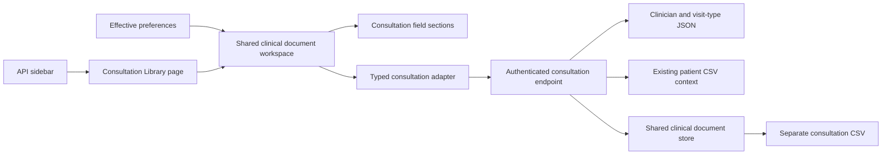

# Clinical Consultation — user and integration guide

Open **Library → Page Library → Clinical Consultation**, immediately after Clinical Triage. This is a direct-entry consultation template with fictional API data. The existing specialty/template composer remains available separately.

## Expanded consultation workspace

The deployed update expands the existing page to **12 one-click sections inside three columns**. The default view still shows the core visit, assessment and plan. Each column has its own tabs with counts of populated fields; switching tabs retains entered data. Effective rail/tabs/wizard preferences continue to control the outer workflow.

| Column | Section tabs | Additional content |
| --- | --- | --- |
| History & visit | Visit, Background, Vitals, Allergies | Medical/surgical/family/social history; eight manual vital readings and measurement time; allergy details, reactions and precautions |
| Examination & assessment | Assessment, Systems, Results, Procedures | System reviews; laboratory/imaging review; procedures and outcome notes |
| Care plan | Plan, Medicines, Referrals, Education | Current medicines, prescription-plan and review notes; referral destination/reason/plan; counselling, consent-discussion and support-needs notes |

There are 44 value fields: the original 11 plus 33 optional expanded fields. The original completion requirements remain. New readings use the API vital metadata and basic numeric validation; they are not imported from triage and do not calculate a clinical score. Invalid hidden readings open the appropriate section before focus is applied. Prescription, referral, procedure and consent text remains documentation, without dispatch or electronic signing.

Old saved records normalize missing optional values to empty strings when read, without rewriting CSV on load. A legacy update that omits new fields preserves their existing saved values. Explicit empty strings clear a field. Completed-note locks remain unchanged. See [expanded-workspace evidence](../releases/unreleased/consultation-expanded-2026-09-09.md) for the tested scope and deployment status.

## Using the page

1. Search for a patient and check the name and MRN. Select a linked encounter when appropriate; an unlinked note is allowed.
2. Choose the consulting clinician and visit type. Enter the chief complaint, history and current medicines.
3. Record examination findings and the clinician's assessment or diagnosis. Explicitly indicate whether allergy information was reviewed or unavailable.
4. Enter the treatment plan, investigation-request notes, follow-up plan and advice. These are documentation fields; they do not send prescriptions or investigation orders.
5. Select **Save draft** to persist an editable note. When keyboard shortcuts are enabled, Ctrl/Cmd+S saves while focus is within the editor.
6. Select **Complete consultation**, review the confirmation, then confirm. Completion locks the note. **Previous consultations** opens saved drafts and completed notes. **New consultation** starts a separate blank note.

The default rail preference shows history, assessment and care plan side by side. The English default layout fits its fields and action bar at 1600 × 900, including the Library tabs and feature alert. Tabs and wizard modes show one group at a time. Long text, large fonts, smaller windows and validation errors can require scrolling; textareas remain resizable.

## Validation, drafts and recovery

Completion requires clinician, visit type, complaint, examination, assessment, treatment, follow-up and allergy-review status. Clinicians and visit types must match API options. All note fields are text with a 2,000-character limit. The page never supplies normal findings, diagnoses or treatment defaults.

Saved drafts are held by the API and reopen with the patient. Recoverable failures retain mounted input and the exact pending operation ID/payload. Retry cannot duplicate the saved note. Patient/record switching asks before discarding unsaved changes. Browser close/reload does not recover changes that were never saved to the API.

Stale revisions are rejected. Load the latest version, review retained local edits, then save again if the note is still a draft. A note completed elsewhere replaces the stale editor with its locked server version. Completion is immutable in this template; subsequent documentation uses a new note, not an amendment to the original.

## Shared components and preferences

`ClinicalConsultationWorkspace` and Clinical Triage both use the shared `ClinicalDocumentWorkspace` and `ClinicalDocumentEditor`. Patient search, identity display, effective tenant policy, saved-history table, save/retry/version handling, confirmation and keyboard behavior are implemented once. `ConsultationSection` supplies the consultation-specific fields through shared cards, grids, inputs, textareas and selects.

The host supplies the existing `PreferenceHost`. Theme, fonts, control radius, form navigation, language, enabled shortcuts, formatted history dates and history-table settings follow effective preferences. Tenant locks take precedence. Writes are disabled when preferences are unavailable or the server reports no write permission. No separate preference store is added.

## Architecture and integration

Contracts are exported by `@pepbits/erp-config`, adapters by `@pepbits/erp-data`, and `ClinicalConsultationWorkspace` by `@pepbits/erp-screens`. **Page Library → List of pages → TypeScript example** shows public imports and the host properties needed to embed the page.

Memoize `createClinicalConsultationAdapter(request, productId)` and `createClinicalTemplateAdapter(request, productId)` around the authenticated request function. Pass both adapters, effective host preferences/policy and a scope key containing authenticated tenant, application and user. Changing that key remounts patient state. Optional `patientId` starts with a selected patient.

An integrating application can implement `ClinicalConsultationAdapter.load(patientId)` and `save(ConsultationSave)` with another backend. The demo sends `POST /clinical-consultation` with `X-Product-Id` and an `action` of `load` or `save`. Loads return patient context, encounters, saved notes, a blank note, configuration and `canWrite`. Saves include expected version, stable operation ID and completion flag. The server returns the authoritative saved record.

The server derives tenant/user from authentication, checks page access and write role, validates the linked encounter and field options, and owns ID, revision, status, actor and history. Selecting a consulting clinician does not impersonate that clinician: the audit actor remains the authenticated user. The current demo permits writes for the existing enterprise-admin role; production clinical roles must be enforced by the integrating API.

## Data and localization

`dummy-api/config/clinical-consultation/form.json` supplies fictional clinicians and visit types. Notes are stored in `RECORD_DATA_DIR/clinical-consultation.csv`, separately from triage, patient and billing data. Each tenant/application/patient bucket has quoted JSON snapshots within the CSV data column. The shared store uses atomic CSV snapshot writes and persists operation receipts and record history. It is a single-process demo store, not a multi-worker transactional database.

Canonical text is under `template.consultation.*` in the shared English, Arabic, Hindi and Malayalam API catalogs. Regenerate fallbacks after editing the catalogs. User-entered clinical text is not automatically translated. Documentation release `2026-09-09-clinical-consultation` includes the page guide, tour target and feature alert.

## Completion boundary

Implemented: compact form, API patient/encounter context and options, saved drafts, validation, immutable completion, history, retry/version handling, shared components, preferences, translations, sidebar entry and integration example.

This page records clinical documentation. Prescription/order dispatch, diagnosis coding, triage-vital import, appointment booking, billing linkage, amendments, electronic signing, clinical decision support and production EHR integration are separate application work. Native-speaker/clinical acceptance and native executable testing remain pending. See the [release evidence](../releases/unreleased/clinical-consultation-2026-09-09.md).

## Catalog location — 10 September 2026

Examples, demo descriptions and user/integration guides are in **Page Library → List of pages**. Working pages open directly to their forms/workspaces. See the [catalog guide](page-library-catalog.md).
