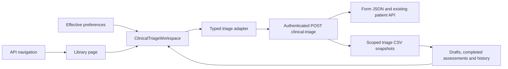

# Clinical Triage — user and integration guide

Open **Library → Page Library → Clinical Triage**, immediately after Billing Clinic. The page provides a reusable triage form with fictional patients from the demo API. The Library also provides a copyable TypeScript example and an in-page guide.

## Using the page

1. Search for a patient and select the matching name and MRN. Check the patient identity above the assessment. Link an encounter if appropriate; an unlinked assessment is allowed.
2. Enter the chief complaint, onset, clinician-assigned priority and allergy review. Enter allergy details when an allergy is reported. Priority and allergy review start unselected.
3. Enter observed vital signs and their measurement time. No normal readings are prefilled. If a required reading is missing, explain why in the provided field.
4. Select the next care area and add precautions and handoff notes.
5. **Save draft** stores an editable assessment on the API. When enabled in preferences, Ctrl/Cmd+S saves while focus is inside the assessment. Reopening the patient loads the latest saved assessment.
6. **Complete triage** validates the form and asks for confirmation. A completed assessment is read-only. Use **New assessment** for a separate reassessment, or **Previous assessments** to open history.

The rail preference now uses the same numbered `RecordSectionLayout` as Master Record – Main and Comprehensive Consultation. One selected section appears beside a live triage snapshot. Save and complete actions stay in the action bar. Tabs and wizard still follow effective preferences and tenant locks. Larger fonts and long translations use the internal record scroll area. See the [clinical workspace update](clinical-workspace-update.md) for the current behavior; older screenshots remain historical evidence.

## Recovery and record integrity

Unsaved input remains in the mounted page after recoverable API failures. Retry retains the original operation ID and payload, preventing a lost response from creating a duplicate assessment. Switching patients or assessments asks before discarding unsaved input.

The API rejects stale versions. The reload action fetches the latest revision and retains local field values if the record is still a draft, so the user can review before saving again. If another user completed the assessment, the latest completed record replaces the stale editor and becomes read-only. Saved drafts survive API restart through CSV storage. Unsaved changes are not silently stored in browser storage and are not restored after closing/reloading the browser.

## Components and preferences

`ClinicalTriageWorkspace` composes the patient selector and identity context with `ClinicalTriageEditor`, `TriageIntake`, `TriageVitals` and `TriageHandoff`. Controls, cards, segmented choices, dialogs, recovery messages and history tables use the shared library. There is no second preference store.

The host supplies `PreferenceHost`: preferences, tenant policy, preference availability and the normal preference update callback. Effective tenant locks win. Theme tokens, font scaling, control shape, form navigation, locale, formatted dates, enabled shortcuts and history-table settings use the existing providers. Writes are disabled while preferences are unavailable or the API reports a read-only role. Native date/time and numeric editing controls retain their standard input behavior; raw measurements are not currency or number-display conversions.

## Technical flow

Contracts are in `@pepbits/erp-config`, the HTTP adapter is in `@pepbits/erp-data`, and the reusable workspace is exported by `@pepbits/erp-screens`. Use the public TypeScript example on the Library page. Memoize both adapters around the authenticated request function and product ID. Pass a scope key containing authenticated tenant, application and user so changing scope clears mounted patient state. The optional `patientId` starts the workspace with an existing patient selected.

Implement `ClinicalTriageAdapter.load(patientId)` and `save(TriageSave)` to connect another application. The demo transport sends `POST /clinical-triage` with `action: load` or `action: save` and `X-Product-Id`. Load returns patient context, encounters, assessments, a blank assessment, form configuration and server write permission. Save includes the assessment, expected version, stable operation ID and completion flag; it returns the server-owned record.

The server derives tenant and user from the authenticated session, checks product/page access and write permission, validates fields and encounter ownership, and controls identity, revision, status, actor and history. The current demo uses the existing enterprise-admin role for writes. Applications must map their own clinical roles on the server.

## Demo data and localization

`dummy-api/config/clinical-triage/form.json` supplies vital fields, units, required-reading flags, priority options and destinations. `RECORD_DATA_DIR/clinical-triage.csv` stores tenant/application/patient buckets with quoted JSON snapshots in the data column. Writes reuse the existing atomic CSV snapshot helper. Corrupt storage produces an error instead of silently reseeding it. This is single-process demo persistence; a production service needs a transactional database, access controls and audit retention appropriate to its application.

Visible text lives under `template.triage.*` in the canonical shared API catalogs for English, Arabic, Hindi and Malayalam. Generated fallbacks must be synchronized after changes. Documentation release `2026-09-09-clinical-triage` adds localized page help, a tour target and a feature alert. User-entered clinical text and patient names are not automatically translated.

## Completion boundary

Implemented: reusable form, API patient/encounter context, editable saved drafts, validation, explicit completion, separate reassessment, history, retry/version handling, managed preferences, four-language catalogs and documentation.

This template does not calculate clinical scores or recommend a priority. Selecting a destination records a handoff value; it does not dispatch staff, notify clinicians or create a production worklist. Clinical protocol approval, native-speaker/domain wording review, production EHR integration and native executable acceptance remain separate work. See the [release and verification record](../releases/unreleased/clinical-triage-2026-09-09.md).
