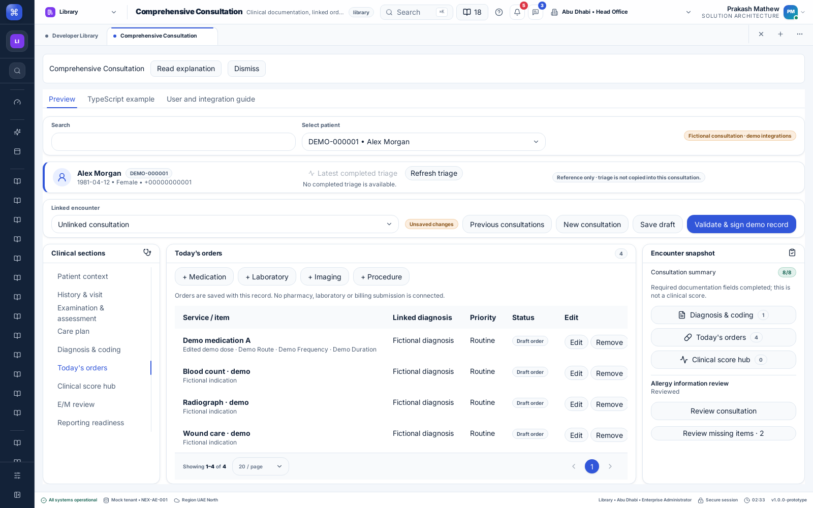

# Comprehensive Consultation

Feature ID: CC. Implemented demo page at **Library → Page Library → Comprehensive Consultation**, after OP Consultation. This is a separate consultation record type; existing OP/Clinical Consultation records are preserved in their original CSV.

## User workflow

1. Select a patient and linked encounter. The patient banner shows identity and the latest completed triage as reference, with refresh and details. Triage may belong to a different encounter and is never automatically copied.
2. Choose a specialty and patient context. Seventeen specialties provide focused documentation prompts. Changing specialty preserves previous entries; review includes all entered specialty notes. These are template starting points, not complete specialty protocols.
3. Enter history, background, vital observations, allergies, examination, systems review, results, procedures, plan, medicines, referrals, education and follow-up. Nine main sections keep documentation, orders and review in a focused desktop workspace.
4. Add diagnosis codes and descriptions. Exactly one recorded diagnosis is primary. Duplicate system/code pairs are rejected. Codes are author-entered; the demo does not certify them against ICD-10-CM or SNOMED catalogs.
5. Add medication, laboratory, imaging or procedure orders. Pick an API service and linked diagnosis. Record relevant instructions and service coding. Medication orders include dose, route, frequency, duration, timing and explicit allergy review. Laboratory orders capture specimen and collection; imaging/procedures capture laterality and contrast details where applicable. Edit or remove orders before signing. Removing a diagnosis with linked orders is blocked until those orders are removed or relinked.
6. Record score assessments and an optional E/M review. GCS sums recorded component values and supports not-testable components; qSOFA sums explicitly assessed criteria. Missing or not-testable values do not become zero. CURB-65, PHQ-9 and GAD-7 store previously assessed totals with source notes; they do not administer questionnaires or calculate those instruments. No treatment recommendation or clinical interpretation is produced.
7. Choose a reporting profile and record reporting notes. Profile integration rows honestly show Not connected. The missing-item check covers this demo's documentation rules, not jurisdictional compliance.
8. Review the full consultation, including unsaved notes, specialty entries, diagnoses, orders, score inputs, coding rationale and reporting notes. Confirm the attestation, then **Validate & sign demo record**. A subsequent edit clears the attestation. Server finalization records the authenticated author, timestamp, revision and configuration version; the record becomes read-only. This is not a certified digital signature.

Save draft persists through the API. Network failures retain current values and retry the same operation identity. Stale-record reload uses the shared conflict flow: refresh server revision while retaining local draft values for explicit review and save; a remotely completed record replaces the editor with its locked saved version. Unsaved navigation asks before discarding; browser-close autosave is not provided. Previous consultations opens saved drafts or signed records; New consultation begins a separate blank record.

## Components and application integration

The exported `ComprehensiveConsultationWorkspace` composes the existing clinical document workspace/editor and patient context, plus dedicated `SpecialtyPanel`, `DiagnosisPanel`, `OrdersPanel`, `ScoresPanel`, `EMPanel`, `ReportingPanel` and `ConsultationReview` components. All controls, cards, tables, tabs and dialogs come from the shared UI library. The existing preference-aware ledger handles order, diagnosis and score rows. No page-local primitive library was introduced.

The Library page includes a copyable public TypeScript example. Supply memoized `createComprehensiveConsultationAdapter`, `createClinicalTemplateAdapter` and `createClinicalTriageAdapter` instances, an authenticated tenant/application/user scope key and `PreferenceHost` properties. Replace the transport/adapters to integrate another application; client scope keys are not authorization.

`POST /comprehensive-consultation` accepts the shared `load` and `save` commands. Save includes patient identity, assessment, expected version, operation identity and completion intent. The server derives tenant/user identity from the session, checks the configured page permission, and currently grants demo writes to `enterprise-admin`. Registration/patient access is resolved through the existing clinical template store. Production clinical role mapping remains an integration responsibility.

Backend configuration lives in `dummy-api/config/comprehensive-consultation/form.json`; the service catalog is read from `services.csv`. Configuration and catalogs are returned by the API. Records, nested orders, diagnoses, scores and idempotency receipts persist atomically in the tenant/application/patient-scoped `comprehensive-consultation.csv`. Restart reads the persisted snapshot. Configuration is loaded at API startup; deploy/restart after changing it. Saved configuration version identifies the rule set used; retaining and resolving historical catalog versions remains necessary before production catalog updates.

The service catalog contains fictional local codes. The order form also accepts manually entered CPT, HCPCS, DoH Service/T-code and dental system identifiers. Selecting a system does not license its catalog, validate a code or create a charge. Pharmacy, laboratory, imaging, billing, HIE and regulatory submission adapters are not connected.

## Preferences, localization and accessibility

Effective host preferences and tenant locks own theme, font, form/result scale, radius, density, table presentation, page size, formatting, shortcuts and form navigation. Rail shows section navigation alongside the focused form; tabs/wizard use the shared outer navigation. Preference-unavailable and read-only sessions disable mutations. Standard keyboard navigation remains available; Ctrl/Cmd+S follows the shortcut preference. Code identifiers retain their original spelling, while UI labels use canonical English, Arabic, Hindi and Malayalam catalogs and generated offline fallbacks. User-authored notes are not machine-translated.

The static desktop layout uses shared CardGrid with explicit column proportions to keep the navigator, active form and snapshot visible. It adds no animation or custom scroll listener. Native-speaking clinical wording review and native executable acceptance remain pending.

## Scoring and coding boundaries

The E/M comparison uses the median of three clinician-selected element levels, satisfying two matching-or-higher elements, and separately compares entered qualifying minutes. It does not infer levels from note length, combine the results into a final claim, calculate prolonged services or certify a payer decision. The illustrative `office-demo-2021.1` time bands are deliberately versioned historical example data, not a current payer rules feed. Final claim-code entry remains a reviewer decision.

Sources used for implementation boundaries: [AMA office E/M framework](https://www.ama-assn.org/practice-management/cpt/cpt-evaluation-and-management), [AMA historical office time bands](https://edhub.ama-assn.org/debunking-regulatory-myths-learning-series/module/2799741), [CMS E/M overview](https://www.cms.gov/medicare/payment/fee-schedules/physician/evaluation-management-visits), [GCS assessment aid](https://www.glasgowcomascale.org/downloads/GCS-Assessment-Aid-English.pdf), and [Sepsis-3 original qSOFA criteria](https://pmc.ncbi.nlm.nih.gov/articles/PMC4968574/). No licensed code descriptions or clinical treatment pathways are bundled.

## Acceptance and remaining work

See the [implementation evidence](../releases/unreleased/comprehensive-consultation-2026-09-10.md) for exact local verification. Production terminology services, medication interaction checks, certified signatures/amendments, order dispatch, charge creation, claim/HIE/regulatory submissions, specialty-domain acceptance and native-language review are separate work. No deployment is claimed in this implementation record.

## Shared rail update — 10 September 2026

The master-record `RecordSectionLayout` now owns rail, tabs and wizard navigation. One selected section appears beside the consultation snapshot. The shared document engine retains unsaved values across navigation and effective policy changes. See the [clinical workspace update](clinical-workspace-update.md). Earlier screenshots above identify the previous navigator.
