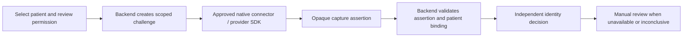

# Identity readers and patient verification

Feature ID: IDENTITY. State: implemented demo; verification and publication are recorded in the [release record](../releases/unreleased/identity-devices-2026-09-10.md). Test guide: [1.0.0](../testing/README.md).

## User problem and outcome

A workstation may need smart-card or RFID readers, national/EID readers, passport scanners and fingerprint or face verification. Three new pages under Library → Device integrations demonstrate these through one shared API-backed workspace: Card & EID readers, Passport scanner and Patient biometric verification.

“Red card” is not yet identified as a specific product or standard. The smart-card/RFID category is a generic provision pending clarification. EID remains a generic national-ID category until the country, provider, device and approved SDK are confirmed. There is no claimed Emirates ID or other government integration.

## User and administrator flows

1. Choose a synthetic patient and compatible reader. Review the selected identity and demo permission acknowledgement before starting. This is a demo attestation, not a validated legal consent record.
2. Start a request. The API binds it to the selected patient, operator, tenant, application, workstation and reader. Only one pending request per operator/workstation is allowed. It expires after two minutes.
3. Choose a backend scenario and simulate the result. Card/passport examples show synthetic name, birth date, document reference and expiry. A mismatch or expired document requires review. Biometric scenarios compare one selected identity; there is no search across a population.
4. A result always states **not authenticated**. No successful demo result grants access, links a real identity, changes patient demographics or unlocks a clinical record. Document reading, matching and authentication remain distinct.
5. Cancel pending capture or send it for manual review. A manual-review request can also be created when biometrics are disabled or declined; it never implies successful identity verification. Expired requests need a new request rather than replaying capture.
6. Tenant administrators enable biometric demonstrations and can lock a reader. Other users may save an unlocked reader preference. Incompatible locks remain visible and block capture on the affected page. Biometrics are disabled initially. Real native-reader choices fail explicitly because no connector is installed.

## Technical contract and integration

| Package / service | Responsibility |
| --- | --- |
| erp-config | `IdentityMethod`, `IdentityDevice`, `IdentityCommand`, `IdentityAttempt`, `IdentityPolicy`, page registry |
| erp-data | `createIdentityAdapter`, authenticated POST `/identity-devices`, product scope and structured failure mapping |
| erp-screens | `IdentityDeviceWorkspace`, `IdentityResultPanel`, `IdentityHistory` with shared preferences and components |
| platform-ports | `IdentityDeviceConnector`, `IdentityCaptureTicket`, `IdentityCaptureResult` extension contracts |
| demo API | CSV synthetic patients, JSON devices/scenarios, scoped CSV attempt/preference/policy storage, expiry, idempotency and authorization |

The endpoint requires authenticated application access and the identity-reader Library permission. Server-derived identity determines tenant and operator scope; workstation and page scope do not authenticate a caller. History access remains owner/workstation-scoped even for administrators. Policy updates require administrator authority and an exact policy version. Simulated capture rechecks current biometric policy and reader lock. Reusing a request for another patient or reader is rejected. Exactly repeated operations reuse the stored response; a new operation cannot complete an already consumed request. Expired capture responses are not accepted on replay.

```ts
import { createIdentityAdapter } from '@pepbits/erp-data';
import { IdentityDeviceWorkspace } from '@pepbits/erp-screens';
import type { IdentityDeviceConnector } from '@pepbits/platform-ports';

const adapter = createIdentityAdapter(authenticatedRequest, product.id);
// Render with scoped stationId, scopeKey, pageId, host preferences,
// preferencePolicy, preferencesAvailable and onPreferenceChange.
const request = await adapter.command({
  action: 'start', stationId, operationId,
  patientId, deviceId, consent: true,
});
```

For a real application, replace the adapter with that application's authorized identity service. The native connector obtains an opaque assertion reference from its provider. Its backend must verify issuer signature, challenge, expiry, selected patient, device, consent and replay protection before making any authentication decision. The exported connector interface is a contract, not a shipped driver or cryptographic verifier. It contains no fingerprint template, image or face embedding field. The demo API rejects unexpected top-level capture fields and stores only synthetic fixture details and operation metadata.



Only the synthetic request lifecycle is implemented here. The connector/provider exchange and real identity decision in the diagram require integration. The demo always returns `authenticated: false`.

## Document readers and biometrics

Passport optical/MRZ reading is not proof that a passport or chip is authentic. Electronic travel-document security uses separate mechanisms described in [ICAO Doc 9303 Part 11](https://www.icao.int/publications/documents/9303_p11_cons_en.pdf). This demo neither parses real MRZ data nor validates passport signatures; native document scanning/OCR, chip access and issuer validation belong to the selected reader/provider integration.

Patient one-to-one biometric verification is different from staff login, passkeys or a workstation's local fingerprint unlock. WebAuthn keeps biometric data local to the authenticator and returns a credential assertion; associating that credential with a patient still requires a properly verified enrolment flow ([W3C WebAuthn](https://www.w3.org/TR/webauthn-3/)). No passkey enrolment, biometric enrolment, liveness engine, population identification or real authentication is implemented in these demos.

## Compatibility, localization and accessibility

Shared cards, tables, selects, checkboxes, recovery messages and the effective PresentationProvider retain theme, font, density, table style and page-size preferences. Tenant device policy is enforced on the API. Dates/numbers use host formatters; identifiers remain unchanged. Canonical English, Arabic, Hindi and Malayalam catalogs and help are regenerated, with human wording review still pending. All actions are labelled buttons/controls; capture needs explicit user action rather than a hidden automatic camera or reader request.

## Acceptance, completed and pending

IDENTITY-01..05 cover patient binding, owner/workstation isolation, permission, policy changes, retries, expiry, mismatch, expired documents, manual fallback and the invariant that demo results do not authenticate. Three pages, shared contracts/components, API-backed fixtures, preference/policy persistence and request history are implemented.

Pending: meaning/model of “Red card,” EID country/provider approval, reader models and OS, vendor SDK/licensing, connector pairing and authentication, signed assertion verification, secure enrolment, production consent/retention rules, liveness and clinical workflow validation, actual device acceptance, and native-speaker review. Clinical patient records and the separate synthetic identity fixtures are not automatically linked. No biometric image/template is captured or persisted by this demo.

## Operations and support

Refresh after a policy conflict. Network retries retain the same operation identity and form values. A pending request can be cancelled before changing patient. Unavailable connectors do not fabricate capture results. Requests retain their expiry in the API and the frontend updates the visible state when the deadline passes. CSV writes are atomic for this single demo process; production retention, secure evidence storage and distributed replay protection require the application's identity service. Prior printer/scanner library behavior is retained.

`createIdentityDeviceConnector` supplies envelope checks for an injected transport: expired tickets and mismatched challenge IDs are rejected; a captured result needs an opaque assertion reference. Unexpected provider fields are not passed through the returned envelope. These checks do not replace issuer-signature validation or patient enrolment. If another reader page is opened during a pending request, the UI keeps the original device and patient visible and blocks capture through the wrong page; cancellation/manual review remain available.
