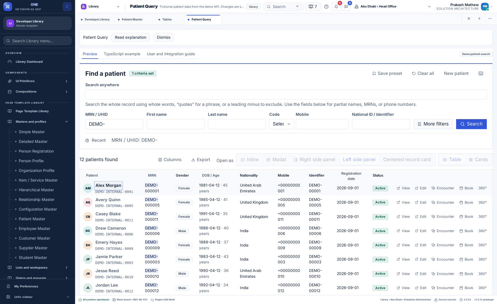

# Library user and integration guide

Feature ID: `LIB`. Status: implemented and deployed to the demo sites; see the [delivery record](../releases/unreleased/README.md) for exact evidence and outstanding acceptance. Desktop use is the primary design target.

## What the Library is for

The Library lets application developers inspect reusable components and page designs, try their behavior and read copyable TypeScript examples. An ERP customer form and a healthcare patient form may have different fields, but they should share input controls, tables, overlays, preference handling and recovery patterns.

The latest changes correct seven audit findings. They make managed settings consistent through shared renderers, replace fixed demo formatting, improve clinical font/radius behavior, and replace six generic reference pages with dedicated content. The [original audit](../../desktop-clients/docs/library-preference-audit.md) is retained as historical evidence.

## Find the right page

| Destination | Use it to |
| --- | --- |
| Component Gallery and 11 groups | Try shared controls, cards, tables, dates, navigation, overlays, inline editing and composition examples |
| Page Template Library and 97 templates | Choose a master, list, order, booking, case, result, finance, reconciliation, report, dashboard, entity or administration pattern |
| Patient Query | Search fictional patients, switch result views, preview records, paginate and export |
| Patient Record | Try a structured multi-section record and supported save/conflict flows |
| Patient 360 | Review related care information and available demo actions |
| Theme Studio | Change actual theme/radius preferences and see shared components respond |
| Accessibility | Change motion/hint/form-font settings and inspect a keyboard-accessible example |
| Page Catalog | Search the current product's available pages and navigate to them |
| Component Contracts | Find component names, actual source locations and generated examples |
| Keyboard Shortcuts | Read the application's shortcut registry and change the shortcut setting |
| Integration Guide | Understand required providers, scope, adapters and policy connections |

Some shared pages are linked from several modules. They remain included in the Library's compliance inventory even when their canonical route belongs to another module.

## User flow: change a preference

1. Open My Preferences, or a dedicated Library page that exposes the relevant preference.
2. Choose the theme, text size, table behavior or other supported value.
3. The ERP preference service applies the effective setting to consuming components and handles persistence.
4. If the administrator locked the setting, its control is disabled. Use the tenant policy workflow if an authorized administrator needs to change the rule.
5. If preference data is unavailable, controls that would change preferences remain disabled until the service recovers.

Theme Studio and Accessibility change real user preferences; they are not isolated color previews. Demo business records and demonstration scenario selectors remain separate from stored preferences.

## Patient Record appearance settings

The Patient Record footer contains record status and actions. Set its appearance in **My Preferences**:

| Location | Setting | Choices |
| --- | --- | --- |
| Behaviour → Layout | Record form style | Rail, Tabs, Wizard |
| Page → Theme | Application theme | All configured themes |
| Page → Typography | Fonts and sizes | Shared family, shell, form and result sizes |
| Page → Spacing and corners | Density | Compact, Comfortable, Spacious |
| Page → Spacing and corners | Corner radius | Existing supported radius range |

Rail places section navigation beside the form; Tabs shows one section at a time; Wizard adds Previous and Next. New, Cancel, Discard, Create, Edit, Save, Encounter and Book stay with the record and appear according to its state and permissions. They are actions, not saved appearance settings.

These controls reuse existing preference keys and the central update service. No migration, new API, duplicate storage or patient-specific appearance overrides are introduced. Administrator locks and preference-service unavailability disable updates. Changes to layout do not reload the patient or intentionally clear current edits; existing unsaved-change and save/conflict handling still applies.

For other applications, pass effective `preferences`, `preferencePolicy`, `preferencesAvailable` and `onPreferenceChange` to `ClinicalPatientWorkspace` as described below. The optional public `preferenceControls` slot remains compatible with existing integrations; the hosted Library no longer fills it with duplicate appearance selectors.

## Administrator flow: set a default, lock or unlock

An account must have the backend-granted `preferences:manage` capability. Open Preferences → Preference policies, choose the application-scoped setting, supply the value, choose Locked if required, and save the policy. A saved unlocked value is a tenant default; a locked value overrides personal choices.

For example, a tenant can lock the form layout to rail and the page size to ten while allowing personal currency formatting. Library layout and page-size controls cannot use local state to bypass those locks. Updating a policy while a page is open must replace conflicting local display choices.

See the [policy API/storage guide](../../desktop-clients/docs/tenant-preference-policies.md) for revisions, scope, retained personal overrides and authorization. Display policy is not permission to view, edit, approve or export business data.

## User flow: try and reuse a template

1. Open Page Template Library and search by application or pattern.
2. Open a template and use Preview to inspect its fields and actions.
3. Change the supported scenario to inspect loading, empty, denied, read-only or failure behavior.
4. Use the layout preference where offered. A managed layout cannot be overridden through the preview control.
5. Open TypeScript example and Configuration. Copy the code and configuration into your application integration, retaining the shared workspace/component imports.
6. Replace the in-memory sample adapter with an authenticated adapter and validate application-specific fields and operations.
7. Test permission, validation, conflict and recovery paths before treating the page as an application feature.

A specialized example still demonstrates its named pattern: a calendar remains a calendar and a skeleton demonstration remains visible as an example. This does not permit a normal page to ignore applicable runtime preferences. Document any new non-applicable setting with its reason and acceptance case.

## Patient Query display preferences

Use **My Preferences → Behaviour → Layout** to choose **Worklist result view** (Table or Card grid) and **Quick view style** (Inline, Centered record card, Center modal, Left side panel or Right side panel).

Patient Query consumes these effective settings directly. Its result toolbar no longer has Table/Cards or preview placement selectors, and the V shortcut no longer changes the result view. Search, filters, Columns, Export, Recent, Save preset and pagination remain available for the current search.

Inline displays patient details below the selected row/card. Other shared preview consumers show an inline card in their content flow. The existing `previewMode` preference now accepts `inline`; its default remains right-drawer. The frontend and demo API share this validator, so tenant locks, persistence and preference import/export apply to Inline as they do to the other modes. Deploy both the updated frontend and restart the demo API before saving this new value.

## User flow: Patient Query

Enter criteria and retrieve results from the demo API. Use column visibility, sort and pagination where available. When editable, the result preference changes table/cards. The preview preference selects left/right drawers, a centered card or a modal; inline preview is available only while the preview setting permits changes.

The export dialog uses the selected CSV or Excel preference. If shortcuts are disabled, the page's custom search/view/help and detail-navigation listeners do not remain active. Normal keyboard navigation is still available.

Recoverable request errors retain supported in-memory criteria or edits. Do not assume this guarantees recovery after closing the application. The clinical guide explains which flows need the separate durable draft service.



Figure 1. Actual local desktop-shell test using fictional demo patients. Preferences were intercepted in the test context. This is evidence of the shown configuration, not a screenshot of a newly deployed release.

## Integrate the current preference contract

`PreferenceHost` is exported by `@pepbits/erp-screens`. The required value is `preferences`; optional properties are `preferencePolicy`, `preferencesAvailable` and the typed `onPreferenceChange` callback. Workspaces can be demonstrated without a host callback; production hosts should connect the real preference service.

```tsx
import React from 'react';
import {useERP} from '@pepbits/erp-shell';
import {PageTemplateWorkspace} from '@pepbits/erp-screens';

type Workspace = React.ComponentProps<typeof PageTemplateWorkspace>;
type Props = Pick<Workspace, 'definition' | 'scope' | 'initialDocument' | 'adapter'>;

export function ApplicationTemplate(props: Props) {
  const {preferences, preferencePolicy, preferencesAvailable, updatePreference} = useERP();
  return <PageTemplateWorkspace
    {...props}
    preferences={preferences}
    preferencePolicy={preferencePolicy}
    preferencesAvailable={preferencesAvailable}
    onPreferenceChange={updatePreference}
  />;
}
```

Use this inside the existing authentication, product, navigation, localization and ERP providers. Do not create an independent preference object with fixed defaults inside each page. The clinical workspace accepts the same host properties; its Library example also shows the clinical adapter and record scope.

For an application using ops-ui without ERP, supply already-resolved values through `PresentationProvider`. This provider applies table presentation; it does not authorize requests, load records or change pagination state. Reuse the host contract/controller for page-size and other interactive choices.

## Different application examples

| Application | Reuse | Application-owned work |
| --- | --- | --- |
| ERP | Customer/supplier masters, orders, financial templates, tables and previews | Domain fields, tax/accounting rules, posting permissions and real APIs |
| Healthcare | Clinical workspaces, encounter/result patterns and related-record panels | Clinical validation, patient access, consent, real care services and sensitive-data policies |
| School | Student master, appointment/scheduler, fee and report patterns | Academic rules, guardian access, fees and school backend contracts |
| New SaaS product | Shell, registered navigation, template engine, shared controls and documentation rules | Product registration, identity, feature configuration and backend adapters |

The current packages are private workspace packages. Public npm availability is not established by their presence in the monorepo. Decide packaging/distribution before documenting a public installation command.

## Troubleshooting

| Symptom | Check |
| --- | --- |
| Control is disabled | Inspect policy locks and `preferencesAvailable`; do not remove the disabled state as a workaround |
| Table ignores chosen spacing | Confirm the authorized page/workspace is inside PresentationProvider; inspect managed-table attributes and consumer-specific CSS |
| Currency/date display differs | Use the ERP formatter and check that generated examples are current |
| Form and result text resize together | Check the nearest form/result scale binding; do not apply one page-wide fixed font size |
| New sidebar item is absent | Check the backend navigation, registered frontend ID, product access and Library inventory |
| Translation key appears literally | Add it to the canonical catalogs in all four languages and regenerate fallbacks |
| Copies import a local relative file | Export the intended contract publicly and fix the generated example; run verification |
| Browser suite cannot sign in | Check the exact API build target, allowed local origins and isolated test server; do not point mutation tests at a shared demo |

## Acceptance and pending work

Read the [versioned cases](../testing/v1.0.0/USE-CASES.md) and [evidence](../releases/unreleased/verification-2026-09-09.md). Implementation, automated tests, browser runs, native execution, native-speaker review and publication are separate statuses. WebKit/native runtime acceptance and real application/domain integration are not declared complete by this guide.
