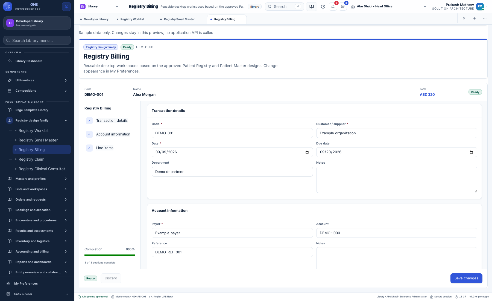
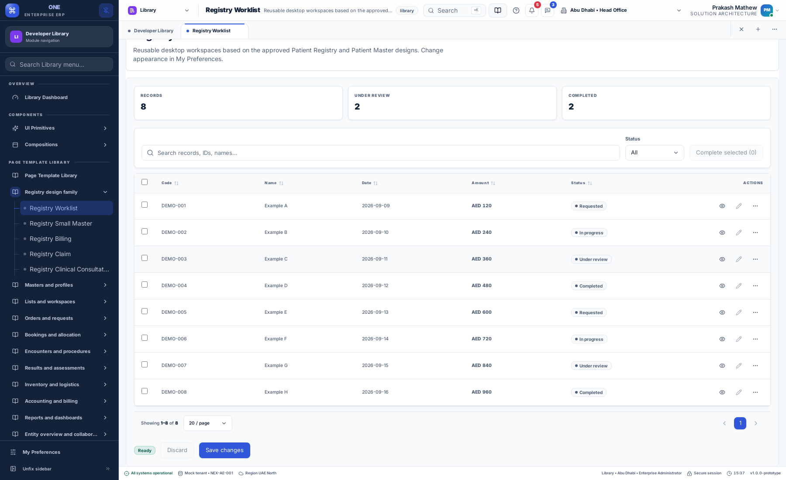
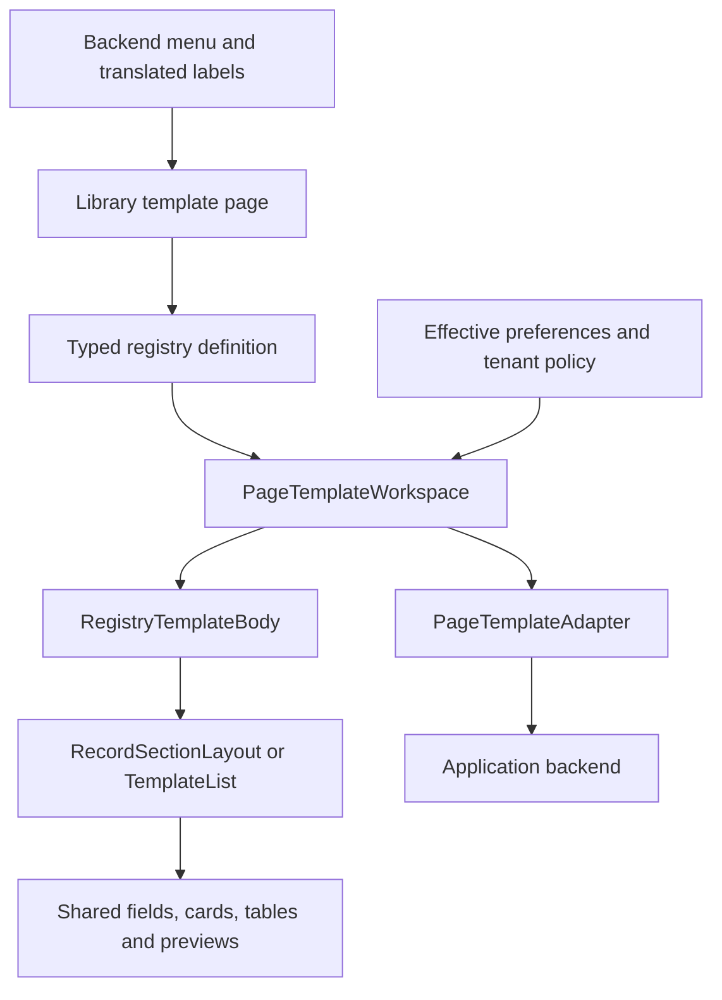

# Registry design family

The approved Patient Registry and Patient Master designs are the reference for this additional reusable desktop template set. The new templates are available in **Library → Page Template Library TEMP → Registry design family**. The original pages and existing template routes remain available.

| Page | Route | Working demonstration |
| --- | --- | --- |
| Registry Worklist | `/library/template-registry-worklist` | Search, status filters, sorting, selection, completion, pagination and record previews |
| Registry Small Master | `/library/template-registry-small-master` | Code, name, category, status, enabled flag and notes |
| Registry Billing | `/library/template-registry-billing` | Transaction details, payer/account, editable quantities/prices, lines and formatted total |
| Registry Claim | `/library/template-registry-claim` | Claim identity, required reference, payer/account, service lines and total |
| Registry Clinical Consultation | `/library/template-registry-consultation` | Patient identity, reason, observations, assessment, plan, follow-up and review checklist |

## Desktop previews

## Use a page

Open a template from the sidebar. Preview shows an editable fictional example. TypeScript shows a copyable public-package example; Configuration contains the typed field and page definition; Guide explains the adapter, preferences and scope contract. Use Scenario to inspect loading, empty, denied, read-only and save-failure behavior. Reset resets the demo, not your personal preferences.

Edit fields and choose Save changes. Required-field and line validation blocks invalid saves. Discard asks for confirmation and restores the last acknowledged saved record. Recoverable save errors retain values and reuse the operation identity on retry. Version conflicts offer an explicit review/replacement flow.

The worklist's Complete selected action changes local example rows. Save changes acknowledges them through the demonstration adapter. It does not approve an actual healthcare or financial transaction.

## Preferences and layout

Use **My Preferences → Behaviour → Layout** for record navigation, worklist view, preview placement and page size. Use Page for theme, typography, density and corners. There are no appearance selectors inside these new templates.

Form pages use the same shared section layout as Patient Master. Rail shows a section list beside the scrollable form; Tabs shows one section at a time; Wizard adds Previous/Next footer actions. The footer keeps save and discard accessible. Billing and claim totals appear once in the identity header. Worklists use the shared table/card renderer and preview wrapper, including Inline where selected.

The host resolves tenant policy before rendering. Locked choices override personal preferences. Changing layout preserves the current editor state. Shared tables consume density, stripes, wrapping, sticky headers and result font scale; dates and amounts use the selected formatter. These are preferences of the host application, not additional per-template stores.

## Technical composition

`PageTemplateDefinition.designFamily = "registry"` selects the presentation. Five definitions in `REGISTRY_TEMPLATES` choose the existing master, list, order and case engines. `RegistryTemplateBody` owns presentation; the shared workspace owns values, validation, save/retry, conflict handling and scope isolation. `RecordSectionLayout` is reused from the patient templates. Primitives have no clinical or ERP API dependency.

The Library adapter is explicitly **in memory**. Navigation and localization come from the demo API. Business records in this template set are fictional frontend fixtures; no new production billing or claims API is implied.

## Integrate into another application

Import `TEMPLATE_BY_ID` from `@pepbits/erp-config` and `PageTemplateWorkspace` from `@pepbits/erp-screens`. Select a definition, or copy its configuration with application-specific fields and labels. Supply your loaded document, a `PageTemplateAdapter`, effective preferences, tenant policy and the current scope. The generated TypeScript tab provides a complete starter example using public exports.

The scope contains tenant, application, user, page and record IDs. Changing scope remounts the editor. Your backend must authenticate the caller, authorize reads/writes, validate domain rules, enforce record versions and retain operation receipts. Client scope and disabled controls are not authorization.

Do not put business rules into the presentation component. Add domain validation at the adapter/server boundary and return structured validation or conflict failures. Follow the [development rules](../development/RULES.md) when extending fields and localization.

## Completion boundary

This delivery provides reusable design templates, local editing, basic validation and demonstrable persistence/recovery contracts. It does not implement tax accounting, payment collection, insurer adjudication/submission, clinical decision support, prescribing, production audit retention or durable patient drafts. Those require the actual application's authorized services. New labels are present in English, Arabic, Hindi and Malayalam; native-speaker approval remains separate.
