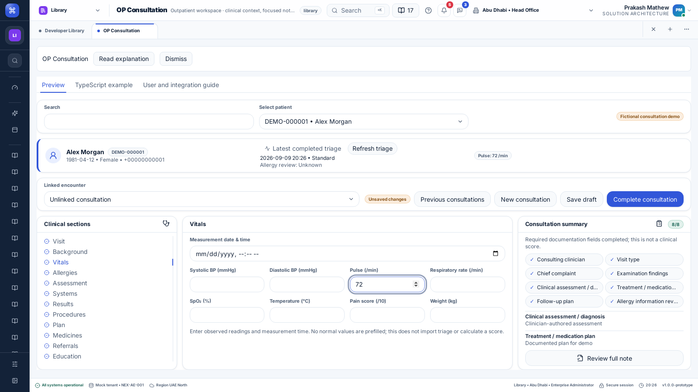

# OP Consultation — 9 September 2026

Local implementation on top of `7b7a672`. Not committed, pushed or deployed.

## Added and changed

- OP Consultation follows Clinical Consultation under Page templates, bringing the Library inventory to 138 destinations and seven Page templates.
- Patient/triage reference banner, section navigator, focused form, documentation summary with field jumps and full-note preview.
- Top encounter actions, shared draft/completion/history handling and all 44 consultation fields. Both consultation pages share the same demo records.
- Read-only latest completed triage, refresh and detail dialog, with explicit empty/error states and no automatic copying into the note.
- Public component/example, four-language catalogs and versioned help/alert `2026-09-09-op-consultation`.

See the [feature guide](../../features/op-consultation.md).

## Verification

Final local results are recorded below. Checks use fictional isolated data and do not imply production EHR integration, native executable testing, clinical/native-speaker approval or deployment.

- `npm run typecheck --prefix desktop-clients`: every package passed.
- Targeted Vitest run of OP Consultation, Clinical Consultation, Clinical Triage editor and Clinic Billing workspace: 4 files, 10 tests passed.
- `npm run test:clinical-api --prefix desktop-clients`: 21 tests passed.
- `npm run build --prefix desktop-clients`: web and desktop browser builds passed; existing bundle-size warnings remain.
- `npm run verify --prefix desktop-clients`: structural, localization, component/example and 138-route Library gates passed. This does not certify every route/setting combination.
- `node desktop-clients/e2e/run.mjs features --suite=<name> --managed-api`, separately for `op-consultation.mjs`, `clinical-consultation.mjs` and `clinical-triage.mjs`: all three passed against Vite on port 3109 and disposable API on 3210. Chromium desktop browser, four catalog languages, draft/save/reload/complete/history and blank-new-record flows. OP additionally verifies real triage refresh/detail, twelve sections and unsaved full-note preview.
- `node docs/tools/check-docs.mjs`: 43 documentation files passed. `git diff --check` passed.

[Source identity and artifact hashes](evidence/op-consultation/manifest.json) identify the base plus changed/new implementation bytes used for these runs. Only documentation/evidence was edited afterward. [OP browser log](evidence/op-consultation/browser.txt), [UI tests](evidence/op-consultation/unit.txt), [API tests](evidence/op-consultation/api.txt), [build](evidence/op-consultation/build.txt) and [structural gates](evidence/op-consultation/verify.txt) retain results. The test commands use Node 24; browser runs load the local Playwright/sysroot environment.

## Remaining delivery and integration work

No commit, push, remote CI or live deployment was performed for this implementation. Native-speaker/domain review, native executable checks, production EHR authorization and integrations are not established. Prescription/order dispatch, clinical signatures and billing/booking workflows remain separate integrations; this page currently stores consultation documentation through the demo CSV API.
